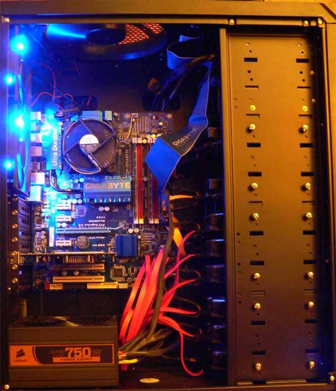

Recently I built a home [NAS](https://en.wikipedia.org/wiki/Network-attached_storage) file server to finally consolidate all of my data into one easily managed network location. I have worked with Network Attached Storage systems before, and I’ve even played with [SAN](https://en.wikipedia.org/wiki/Storage_area_network) solutions before, but this was my first time building one from scratch.

The goal of this project is to have a massive, always-on, redundant, and wicked fast network accessible storage drive where I can save all of the files from my massive media collection for permanent archive. This central location will be my grand file repository for basically everything. Ideally I should be able to loose my desktop and laptop drives without losing anything that I care about.

I’ve had plenty of time to define exactly what I needed in a file server, and requirements were actually pretty simple:

 * Separate system and storage arrays
 * [RAID](https://en.wikipedia.org/wiki/RAID) failure protection on both arrays
 * At least 7 terabytes of usable storage
 * At least 60 MB/s of real world network throughput
 * Expandable base that I can add storage to when it become necessary
 * Excellent hard drive cooling
 * Reasonably low power requirements
 * Less than $2,000 total

This is the story of my particular NAS build and some of the stuff I learned during the course of this project.

<!-- more -->

I’m glad to say that I have managed to build a system that has met my requirements. But I did have to make some sacrifices for the budget, most notably on the RAID controller. I had really wanted to go with a real hardware RAID controller such as the [Adaptec 5805](http://www.newegg.com/Product/Product.aspx?Item=N82E16816103099). But that would have blown my budget way over my $2k limit. So I had to make do with the onboard Intel ICH10R raid controller.

There are a great many benefits to using a real hardware RAID controller, but I just couldn’t justify the price for a home NAS, or at least not just yet.

The Intel ICH10R is a proven and well tested RAID controller with plenty of bandwidth and a fairly nice interface, so it will work just fine for a home NAS.

### The build

<figure>

</figure>

The final build that I ended up with was basically just a normal Intel Core2 system with a bunch of hard drives instead of an insanely powerful video card. Looking back, there are a couple improvements that I could have made, but most of them would have put me over budget (see Concessions).

With the exception of the motherboard, I made all of the major purchases during the Black Friday sale on NewEgg. This saved me literally hundreds of dollars and allowed me to spring for 2TB instead of 1.5TB drives and still stay in the budget. Give it 6 months and even the base prices will be within budget.

 * Antec 1200 computer case
 * Gigabyte EP45-UD3R motherboard
 * Intel E6300 dual core 2.8GHz processor
 * 4GB Corsair Dominator RAM
 * 2x Western Digital Caviar Black WD7501AALS 750GB 7200 RPM hard drives
 * 6x Seagate Barracuda LP ST32000542AS 2TB 5900 RPM hard drives
 * CORSAIR CMPSU-750TX 750W power supply

All said and done, this build came out to slightly less than my $2,000 budget.

### Equipment details

This system is built around the socket 775 (Intel Core2) platform. Sure, Core I7 is faster, but there is absolutely no need to have that kind of power (or cost) for a simple file server. In fact, any Intel Core2 processor is horribly overpowered for this purpose. But they are so cheap there there isn’t any reason to go for anything less right now.

This excess of power will give me some additional head-room if I decide to run some other services off of this machine.

#### Gigabyte EP45-UD3R motherboard

This is a solid socket 775 motherboard with 8 total SATA ports, 6 SATA ports running on the ICH10R controller and 2 more running on the Promise controller. This will work perfectly for my plan, 2 reasonably fast system drives in RAID 1, and 6 huge data drives in RAID 5. The DVD drive will have to run off of the IDE port. Sadly, the motherboard I received was DOA and had to be sent back for a replacement on RMA. The replacement is working perfectly.

#### Intel E6300 dual core 2.8GHz processor

The original plan was for one of the latest 45nm Celeron processors, but the E6300 came on sale when I was making the purchase and I managed to get a few hundred megahertz and 2MB more level 2 cache for about the same price.

#### Corsair Dominator RAM

This is just good RAM at a reasonable price. 4GB is more than enough for a file server. The plan is to have enough RAM to disable the system swap-file and get a little bit more longevity and speed out of the operating system.

#### Western Digital Caviar Black hard drives (2 drives)

These are good fast drives with a good history. Blacks are the high-power, high-speed versions.

#### Seagate Barracuda LP ST32000542AS 2TB (6 drives)

The reason for these drive is simple, price. The Black Friday sale saw these drop to $140 shipped. Seagate has a pretty poor reputation as a hard drive manufacturer right now, mostly because of the [7200.11 firmware fiasco](http://www.engadget.com/2009/01/16/seagate-barracuda-7200-11-drives-said-to-be-failing-at-an-alarmi/). But the same 2TB offering from Western Digital was $200 at the time, so it was out of the question for my budget. These drives are running the 7200.12 firmware which has proven to be stable and safe. The 5900 RPM speed is a bit odd, and may become a problem for future replacements. However, in the end, these storage drives were clearly going to be the single biggest expense in the project so budget took over.

These six drive in a RAID 5 configuration will yield just over 9TiB of usable storage.

#### Antec 1200 computer case

The case needed to fit 8 hard drives and be able to cool them very well. The Antec 1200 fills this role perfectly. There are 3 hard drive cradles that hold 3 hard drives each. Each drive cradle has a 120mm fan in front of it. This keeps the drives near room temperature even at full load for hours on end. The whole front of the case is 12 5.25 inch slots, so if I need more space in the future it should be possible to install 3x 4-slot drive cradles that would hold 16 hard drives. I suspect that I will simply find a purpose built file server case if I need that kind of storage, but the possibility is there.

#### CORSAIR CMPSU-750TX 750W power supply

This system will never use that amount of juice, but you never want to run low. This power supply runs off of one single [power supply rail](https://en.wikipedia.org/wiki/Power_supply_rail#Multiple_.2B12_V_Rails). This means that you don’t have to worry about balancing power needs across rails. A huge benefit. This power supply also has 8 SATA power connectors, something to consider when you’re running a lot of SATA hard drives. Member of the &gt;80% efficiency club, so hopefully that will help keep the electricity bill down a bit.

#### Miscellaneous parts

**Video Card:** The video card has to be PCI, not PCI-Express. I need to keep the PCI-Express slot on the motherboard free for a RAID controller in the future, and there is no purpose having a high-power video card on a system that will hardly ever have a monitor hooked up to it.

**DVD Drive:** Random IDE DVD drive. Just need to be able to install the operating system without taking up a SATA port.

**CPU Cooler:** Right now I’m just using the stock Intel CPU cooler. It works perfectly fine. In the future I would like to put one of the big Xigmatec or Zalman coolers, but it isn’t needed for this system.

### Concessions

All of the major sacrifices in this build were needed to meet the budget requirement. If I had a $3,000 budget then I could have built a perfect file server. Unfortunately, that is a bit too much to spend with my salary on a home file server.

#### On-board RAID controller

A professional file server should be running a dedicated hardware RAID controller card. They are faster, have better alerts and disaster recovery and are theoretically easier to replace in the event of a controller failure. However, they are very expensive for a home server budget. A good controller card will cost between $500 and $1,000. For this build budget there was simply no way that I could purchase a hardware controller and still meet my storage requirements.

#### Not using ECC RAM.

I should have been looking for a motherboard that supports ECC RAM. This thought never even crossed my mind when I was planning it. However, the idea of a Network Attached File Server is that it will be online 24/7/365. It would be best if it was running ECC RAM. This isn’t the end of the world however, it is unlikely that this will ever cause a problem.

#### The Promise RAID controller is slow.

Not prohibitively slow, but it is noticeably slower than the Intel ICH controller. This is unfortunate since I have to use the 6-port ICH10R controller for the storage array and the Promise 2-port controller for the system array. I wish I could have gotten a RAID controller card and ran the system drives off of the ICH.

#### Not using RE RAID drives.

Ideally, I should be using the Western Digital RE (RAID Specific) drives for this build. However, at the time they are $300 each for the 2TB version and not even available from NewEgg. Budget dictates that these are not going to happen.

### A (reasonably) solid foundation

This platform gives me a solid foundation that should be able to support my storage needs for years to come. If I need to upgrade then I do have a clear path to do so.

For the last few years all RAID controller cards have been either [PCI-Express](https://en.wikipedia.org/wiki/PCI_Express) or [PCI-X](https://en.wikipedia.org/wiki/PCI-X) based. There is no sign of that changing anytime soon, and even if it does, manufacturers will continue to produce PCI-Express controller cards for a few years after the change to support the legacy crowd. Even today you can still find old fashioned PCI cards.

By using a plain old cheapo PCI video card I have left the PCI-Express slot open for a real RAID controller card. So if and when I need to upgrade I can buy a RAID card and whatever the best price/performance deal hard drives there are at the time and build an array on the new controller.

Here is what the upgrade plan looks like for this system:

 1. Buy PCI-Express RAID controller card and drives
 2. Build a new array on the new controller
 3. Move all data on the old storage array to the new one

I believe this is a fairly solid future-proofing plan that will let me reuse the investment in the base system and focus the upgrade costs on even more professional and scalable equipment.

If I wanted to continue to use the 2TB drives I could purchase a purpose-built file server case ([example](http://www.newegg.com/Product/Product.aspx?Item=N82E16811219031)) or fill the current Antec case with a bunch of aftermarket drive cages ([example](http://www.newegg.com/Product/Product.aspx?Item=N82E16817994061)). The motherboard and processor have plenty of power and bandwidth, and the 750 watt power supply should be able to handle 16 drives with ease.

I’m sure all of this will be completely deprecated in 5 years when we all have 10gig home networks and 10TB SSD drives for $150. But I suspect this will hold me over until that time comes.

**Continued in [Part 2: RAID Setup](/2010/01/building-a-home-network-attached-storage-server-part-2-raid-setup/).**
