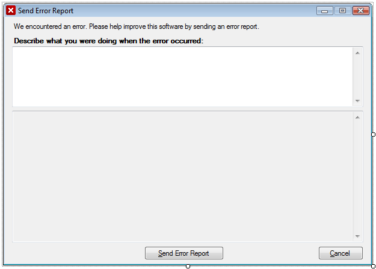

If you’re writing a .NET desktop application that you intend to distribute then you may find it very helpful to build a system for reporting any exceptions that end-users experience back to you. Being able to gather raw exception reports from an app somewhere in the wild will make it much easier to find problems that never appeared on your development and testing environments.

This can save you a lot of headaches when dealing with users complaining about problems that you simply cannot reproduce. An error reporting system has the added benefit of improving end-user morale. It makes people feel much better when they know the developer has received a real report about the problem they encountered.

My method for handling exceptions and reporting them is very simple. However, it does require a little extra work to setup. I’ll walk you through my particular method and give you the basic C# code that I use.

<!-- more -->

### The system

There are four pieces to this reporting system:

 * A class to process and log exceptions.
 * Attach functions to the [`UnhandledException`](http://msdn.microsoft.com/en-us/library/system.appdomain.unhandledexception.aspx) and [`ThreadException`](http://msdn.microsoft.com/en-us/library/system.windows.forms.application.threadexception.aspx) events.
 * Build and distribute a separate Windows Form Application in your solution to report the exceptions back.
 * Create a hosted web application to receive and process the submitted exception reports.

### The ErrorLog class

This is a simple class that I wrote to process an exception passed to it and save the information to a text file. The code is all pretty much self-explanatory so I won’t go in to too much detail here.

I do want to point out that I am saving the error logs into the ApplicationData folder. This is standard practice since Windows Vista came out because UAC might stop you from saving files anywhere else on the system.

```csharp
public sealed class ErrorLog
{
	#region Properties

	private string _LogPath;
	public string LogPath
	{
		get
		{
			return _LogPath;
		}
	}

	#endregion

	#region Constructors

	public ErrorLog()
	{
		_LogPath = Path.Combine(Path.Combine(Environment.GetFolderPath(Environment.SpecialFolder.ApplicationData), System.Windows.Forms.Application.ProductName), "Errors");
		if (!Directory.Exists(_LogPath))
			Directory.CreateDirectory(_LogPath);
	}

	public ErrorLog(string logPath)
	{
		_LogPath = logPath;
		if (!Directory.Exists(_LogPath))
			Directory.CreateDirectory(_LogPath);
	}

	#endregion

	#region Public Methods

	/// <summary>
	/// Logs exception information to the assigned log file.
	/// </summary>
	/// <param name="exception">Exception to log.</param>
	public string LogError(Exception exception)
	{
		Assembly caller = Assembly.GetEntryAssembly();
		Process thisProcess = Process.GetCurrentProcess();

		string LogFile = DateTime.Now.ToString("yyyy-MM-dd_HH.mm.ss") + ".txt";

		using (StreamWriter sw = new StreamWriter(Path.Combine(_LogPath, LogFile)))
		{
			sw.WriteLine("==============================================================================");
			sw.WriteLine(caller.FullName);
			sw.WriteLine("------------------------------------------------------------------------------");
			sw.WriteLine("Application Information");
			sw.WriteLine("------------------------------------------------------------------------------");
			sw.WriteLine("Program      : " + caller.Location);
			sw.WriteLine("Time         : " + DateTime.Now.ToString("dd/MM/yyyy HH:mm:ss"));
			sw.WriteLine("User         : " + Environment.UserName);
			sw.WriteLine("Computer     : " + Environment.MachineName);
			sw.WriteLine("OS           : " + Environment.OSVersion.ToString());
			sw.WriteLine("Culture      : " + CultureInfo.CurrentCulture.Name);
			sw.WriteLine("Processors   : " + Environment.ProcessorCount);
			sw.WriteLine("Working Set  : " + Environment.WorkingSet);
			sw.WriteLine("Framework    : " + Environment.Version);
			sw.WriteLine("Run Time     : " + (DateTime.Now - Process.GetCurrentProcess().StartTime).ToString());
			sw.WriteLine("------------------------------------------------------------------------------");
			sw.WriteLine("Exception Information");
			sw.WriteLine("------------------------------------------------------------------------------");
			sw.WriteLine("Source       : " + exception.Source.ToString().Trim());
			sw.WriteLine("Method       : " + exception.TargetSite.Name.ToString());
			sw.WriteLine("Type         : " + exception.GetType().ToString());
			sw.WriteLine("Error        : " + GetExceptionStack(exception));
			sw.WriteLine("Stack Trace  : " + exception.StackTrace.ToString().Trim());
			sw.WriteLine("------------------------------------------------------------------------------");
			sw.WriteLine("Loaded Modules");
			sw.WriteLine("------------------------------------------------------------------------------");
			foreach (ProcessModule module in thisProcess.Modules)
			{
				try
				{
					sw.WriteLine(module.FileName + " | " + module.FileVersionInfo.FileVersion + " | " + module.ModuleMemorySize);
				}
				catch (FileNotFoundException)
				{
					sw.WriteLine("File Not Found: " + module.ToString());
				}
				catch (Exception)
				{

				}
			}
			sw.WriteLine("------------------------------------------------------------------------------");
			sw.WriteLine(LogFile);
			sw.WriteLine("==============================================================================");
		}

		return LogFile;
	}

	#endregion

	#region Private Methods

	private string GetExceptionStack(Exception e)
	{
		StringBuilder message = new StringBuilder();
		message.Append(e.Message);
		while (e.InnerException != null)
		{
			e = e.InnerException;
			message.Append(Environment.NewLine);
			message.Append(e.Message);
		}

		return message.ToString();
	}

	#endregion
}
```

### Attaching exception events

In your main program you will need to add functions to the `UnhandledException` and `ThreadException` events. These functions will capture the exception, display an alert to the user letting them know that something terrible just happened and launch the reporting application.

This is really very easy. In `void Main` you will want to add the following lines. They should be the very first lines so that we start catching exceptions as soon as the program starts.

```csharp
// Initialize the error log
Logger = new ErrorLog();

// Handle unhandled exceptions
AppDomain.CurrentDomain.UnhandledException +=
	new UnhandledExceptionEventHandler(CurrentDomain_UnhandledException);
Application.ThreadException +=
	new System.Threading.ThreadExceptionEventHandler(Application_ThreadException);
```

Now add the `CurrentDomain_UnhandledException` and `Application_ThreadException` functions to call the `ErrorLog.LogError` method, display a message to the user and launch the reporting program.

```csharp
static void CurrentDomain_UnhandledException(object sender, UnhandledExceptionEventArgs e)
{
	try
	{
		Exception ex = (Exception)e.ExceptionObject;
		string LogFile = Logger.LogError(ex);

		MessageBox.Show(
			"The application encountered a fatal error and must exit. This error has been logged and should be reported using the Error Report utility.\n\n" +
				"Error:\n" +
				ex.Message +
				"\n\nStack Trace:\n" +
				ex.StackTrace,
			"Fatal Error",
			MessageBoxButtons.OK,
			MessageBoxIcon.Stop);

		Process proc = new Process();
		proc.EnableRaisingEvents = false;
		proc.StartInfo.FileName = Path.Combine(AppDomain.CurrentDomain.BaseDirectory, "ErrorReport.exe");
		proc.StartInfo.Arguments = LogFile;
		proc.Start();
	}
	finally
	{
		Application.Exit();
	}
}

public static void Application_ThreadException(object sender, System.Threading.ThreadExceptionEventArgs e)
{
	DialogResult result = DialogResult.Abort;
	try
	{
		string LogFile = Logger.LogError(e.Exception);

		result = MessageBox.Show(
			"The application encountered a error. This error has been logged and should be reported using the Error Report utility.\n\n" +
				"Error:\n" +
				e.Exception.Message +
				"\n\nStack Trace:\n" +
				e.Exception.StackTrace,
			"Application Error",
			MessageBoxButtons.AbortRetryIgnore,
			MessageBoxIcon.Stop);

		Process proc = new Process();
		proc.EnableRaisingEvents = false;
		proc.StartInfo.FileName = Path.Combine(AppDomain.CurrentDomain.BaseDirectory, "ErrorReport.exe");
		proc.StartInfo.Arguments = LogFile;
		proc.Start();
	}
	finally
	{
		if (result == DialogResult.Abort)
		{
			Application.Exit();
		}
	}
}
```

### The reporting program

The error submission program itself will open the log file you passed to it and give the user an opportunity to provide some details about what they were trying to do when the exception occurred. When the user clicks send it will post the information to the web for you to read later.

Add a new project to your solution, a Windows Form Application and name it ErrorReport. Create two labels, two large text boxes and two buttons. One label will be a description telling the user what is happening, it should read something like “We encountered an error. Please help improve this software by sending an error report.” The second label will be for the user report box. Asking them to tell us what they were doing when the exception happened. Something along the lines of ” Describe what you were doing when the error occurred:”

This is what I ended up with:



This interface can certainly be improved, but this is enough to get all of the functionality you need. The first text box is where users enter their report, the second text box is set to be read-only and will display the raw error text that will be sent back to the developer. It is always good practice to show people exactly what information you intend to send so they can look it over.

Again, the code is pretty self-explanatory, so I won’t go into much detail. But I would like to point out that the program will automatically close after it posts the report to the web. So if the user tries to close the form themselves we can assume that they haven’t sent the report. In this case I display a warning to that effect. We really want people to send us these reports so we can kill bugs out in the wild.

```csharp
public partial class Form1 : Form
{
	private static string _PostURI = "http://your.site.address/reporterror.php";
	private FileInfo _ErrorFile;

	public ErrorReport(FileInfo errorFile)
	{
		_ErrorFile = errorFile;

		InitializeComponent();

		using (StreamReader reader = File.OpenText(errorFile.FullName))
		{
			textBox2.Text = reader.ReadToEnd();
		}
	}

	private void ErrorReport_FormClosing(object sender, FormClosingEventArgs e)
	{
		if (MessageBox.Show("Are you sure you want to exit without sending the error report?", "Exit", MessageBoxButtons.YesNo, MessageBoxIcon.Warning) != DialogResult.Yes)
			e.Cancel = true;
	}

	private void buttonSend_Click(object sender, EventArgs e)
	{
		string data = "name=" + HttpUtility.UrlEncode(_ErrorFile.Name) +
			"&desc=" + HttpUtility.UrlEncode(textBox1.Text) +
			"&log=" + HttpUtility.UrlEncode(textBox2.Text);

		string response = HttpPost(_PostURI, data);

		if (response.IndexOf("success") > -1)
		{
			MessageBox.Show("Thank you for sending your error report!", "Error Report Sent", MessageBoxButtons.OK, MessageBoxIcon.Information);
			Application.Exit();
		}
		else
		{
			MessageBox.Show("There appears to be an error with the system. Please try again later.", "Error", MessageBoxButtons.OK, MessageBoxIcon.Warning);
		}
	}

	private void buttonCancel_Click(object sender, EventArgs e)
	{
		Application.Exit();
	}

	// Source: http://en.csharp-online.net/HTTP_Post
	private string HttpPost(string uri, string parameters)
	{
		WebRequest webRequest = WebRequest.Create(uri);

		webRequest.ContentType = "application/x-www-form-urlencoded";
		webRequest.Method = "POST";
		byte[] bytes = Encoding.ASCII.GetBytes(parameters);
		Stream os = null;

		try
		{
			// send the Post
			webRequest.ContentLength = bytes.Length; // count bytes to send
			os = webRequest.GetRequestStream();
			os.Write(bytes, 0, bytes.Length); // send it
		}
		catch (WebException ex)
		{
			MessageBox.Show(ex.Message, "HttpPost: Request error", MessageBoxButtons.OK, MessageBoxIcon.Error);
		}
		finally
		{
			if (os != null)
			{
				os.Close();
			}
		}

		try
		{
			// get the response
			WebResponse webResponse = webRequest.GetResponse();
			if (webResponse == null)
			{
				return null;
			}
			StreamReader sr = new StreamReader(webResponse.GetResponseStream());
			return sr.ReadToEnd().Trim();
		}
		catch (WebException ex)
		{
			MessageBox.Show(ex.Message, "HttpPost: Response error", MessageBoxButtons.OK, MessageBoxIcon.Error);
		}

		return null;
	}
}
```

Do not try to send email from user machines. You simply cannot guarantee what kind of firewall or security settings are on their network. If your error reporting program always errors out then you will look like an idiot.

### The web application

This is where we will receive the exception reports from users. Really you can do anything you want with the data, store it in a database, write it to a bug tracking system, email it to your mom, whatever. For the sake of simplicity, I will simply write them to a text file.

I’m using PHP for this part just because anyone can run PHP on their server, not every machine can run .NET web apps. This is just a quick and dirty example. I’m sure you can figure out how to do this in whatever language or framework you want to use.

```php
<?php

header('Content-Type: text/xml');
echo '<' . '?xml version="1.0" encoding="UTF-8" ?' . '>';

$clientName = isset($HTTP_POST_VARS['name']) ? trim($HTTP_POST_VARS['name']) : "";
$clientDesc = isset($HTTP_POST_VARS['desc']) ? trim($HTTP_POST_VARS['desc']) : "";
$clientLog = isset($HTTP_POST_VARS['log']) ? trim($HTTP_POST_VARS['log']) : "";

$data_file = "/path/to/your/directory/errorlogs/$clientName";

$file = fopen($data_file, 'w');
if (flock($file, LOCK_EX)) {
	fwrite($file, "$clientDesc\n\n--------\n\n$clientLog");
	flock($file, LOCK_UN);
}
fclose($file);

?>

<errorReport>
	<result>success</result>
</errorReport>
```

This is just an example script. Don’t use this one for the real thing, you need to do some input sanitizing, string cleaning, and preferably make the response actually reflect success or failure. But it should give you an idea of just how easy it is to receive the posted data in a format that you can use.

### Conclusion

It doesn’t take that much effort to build a modular and portable exception reporting system. Once you’ve built it you can use it in all of your distributable apps.

Personally, I find this kind of error reporting invaluable. Being able to read exception reports from software in the wild is like having an extra QA team. People who really like your software will be happy to provide this feedback. Remember to publicize the fixes you’ve made based on user reports. It will make everyone feel very satisfied to hear that the developers are listening and improving the application.

If you have any questions, comments or suggestions I would love to hear them! Please leave a comment below and I’ll respond back.
