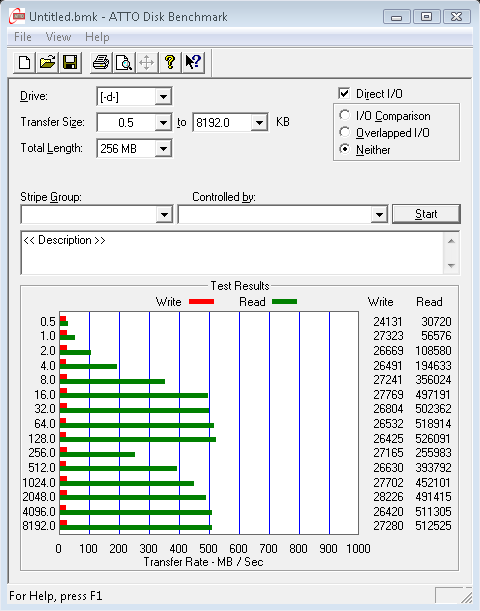
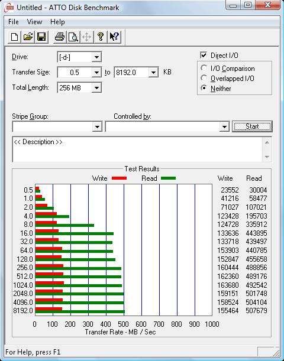
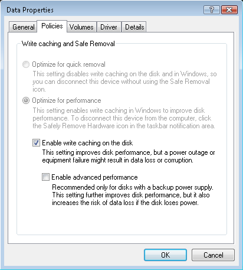

This is Part 2 in the [Building a home Network Attached Storage server](/2009/12/building-a-home-network-attached-storage-server-part-1-hardware/) series. In this article I will talk about some of the options for the RAID arrays and the art of RAID configuration.

Now that we know what hardware this system is going to be built on we have to decide what technology is going to run it all. We still have several options for RAID controllers and software.

One item that really needs to be mentioned is that if you use Windows computers to access the NAS you will want to use Windows Vista, 7 or Server 2008 as the NAS operating system. This is for one simple reason, Windows Vista in 2006 introduced [Server Message Block 2.0](https://en.wikipedia.org/wiki/Windows_Vista_networking_technologies#Server_Message_Block_2.0). SMB2 is a massive boost to network file transfer speeds. Where an XP machine may only be able to send 50MB/s over the network, the same machine running SMB2 will be pushing 80MB/s. So if you are going to be using Windows on your desktop, you probably want to be using Windows on your NAS.

The first step is deciding what RAID controller you are going to use for the system.

<!-- more -->

### RAID controller options

There are several options for RAID arrays on the NAS server, the most obvious, and the one I chose was RAID 5 using the on-board Intel ICH10R and Promise RAID controllers. Software RAID has the reputation of being even slower than fake-RAID. Though I can’t comment on it in this instance because I didn’t bother trying it and running benchmarks. Here is my take on the RAID controller options:

#### On-board Intel ICH10R and Promise RAID

This is the cheapest and highest performance option for my budget. As I explained in the first article, the on-board ICH10R controller is an implementation of *fake-RAID*, a mix of hardware and software. You have to configure the ICH10R to read the SATA drives as a RAID array. It will then only show those drives to the operating system as an ICH RAID disk. The OS needs to have a driver installed to interface with the ICH controller and see the RAID drive as an actual usable hard drive.

Using the ICH10R controller means that if you ever have to replace the motherboard, and don’t want to lose the array, you will have to replace it with another Intel ICHxR motherboard. Revisions if Intel’s ICH RAID are backwards compatible, but not forwards compatible. This means that you will have to use a motherboard with ICH10R or higher.

The promise controller is the same deal, but since I am using RAID 1 on that array I can literally take one of the RAID drives out and plug it into another computer and it will be recognized as regular SATA drive with a regular partition. Instantly available.

#### Windows Server software RAID

The Windows Server family of operating systems have a fairly nice software RAID controller. Not really fast, not really slow. Windows Server software RAID has the benefit of being *hardware independent*. It doesn’t matter what hardware you have to replace in the system. Just tell windows that those drives are in a RAID array and it will see them as such.

The obvious downside, and the problem that caused me to drop this option, you have to buy a copy of Windows Server. I don’t know if you’ve priced this software lately, but Windows Server 2008 is prohibitively expensive, like $700 expensive. There was no way I was going to spring that kind of cash for it.

There is Windows *Home Server*, which is much cheaper, but it is only available in a 32-bit version and has been neutered of most of the other beneficial Windows Server features.

#### Ubuntu software RAID

I am familiar with the Ubuntu operating system, so this was another one of the options I considered. Ubuntu also has support for Linux software RAID. It has all of the same benefits and drawbacks as Windows Server software RAID, with one major additional drawback that made me drop it as an option, it doesn’t have the Windows SMB2 system. On my Windows network SMB2 will make a night-and-day difference in network throughput.

#### OpenSolaris ZFS file system

The OpenSolaris [ZFS file system](https://en.wikipedia.org/wiki/ZFS) is the most intriguing RAID option I’ve seen. It is a form of software RAID that is reportedly very fast, and very smart. After doing some reading on the ZFS file system and it’s native support and very smooth implementation for RAID, I was really interested. It’s been quite some time since I worked on a Solaris system so there would have been an extra learning curve, but in the end I dropped this option for the same reason as Ubuntu. It doesn’t have SMB2.

If you don’t plan on using Windows machines as the clients for the NAS, and don’t mind dealing with the quirks of Solaris, then this is my recommendation. ZFS is a very cool system and they are constantly improving it.

#### Buy a real hardware RAID controller

This wasn’t an option in my build, If you have the cash, this is the best option. Hardware RAID controllers are much faster, much smarter, and offer better data security. They read faster, write faster, rebuild faster, and you can (and should) attach an internal battery backup. But as I stated in Part 1, this simply was not in my budget.

### RAID level options

In my server I chose to use RAID 1 on the system array (2 drives) and RAID 5 on the storage array (6 drives). In my opinion this was the most stable and cost effective solution. However, I can’t to an article about NAS servers without discussing RAID level 10.

#### RAID 1

Mirroring, RAID 1 is pairs of mirrored drives. If one drive fails the other drive in the mirror still has all of the data in tact. This is *the* solution for a pair of drives with redundancy. Which is why I chose this level for the pair of system drives. You can lose 1 drive in the mirror and still have all your data.

#### RAID 5

Striping + parity. In RAID level 5 you have a parity for every stripe. This is the storage solution with the best cost/benefit ratio (in my opinion). Basically you lose one drive worth of storage capacity to parity (total storage = n-1). So my six 2TB drive in a RAID 5 array will have 10TB of storage (approximately 17% capacity reduction for redundancy). You can lose one drive in a RAID 5 array and still have your data, 2 drive failures means catastrophic data loss. The downside of RAID 5 is that redundancy is based on parity, and parity calculations are hard. This makes RAID 5 writes much slower than the alternative.

#### RAID 10

Mirroring + striping. This is the fastest and most redundant solution for a storage array. The data is mirrored across the drives and then striped for speed. This is very fast and very reliable. In RAID 10 you can (theoretically) lose two drives and still have all of your data. Though if you lose two drives on the same side of the array it means catastrophic data loss. It is better than RAID 5 in almost every way. The one major drawback, you lose 50% of your data storage to redundancy. So my six 2TB drives would only yield 6TB of storage.

### The RAID 5 vs RAID 10 argument

There is a growing voice in the data storage community proclaiming that RAID 5 is a [terrible solution](http://miracleas.com/BAARF/RAID5_versus_RAID10.txt). There are many valid points to these argument, most of which revolve around performance when in degraded mode, which isn’t a big concern for a simple archive and storage array. The other big complaint is the increase in the chance of catastrophic failure when compared RAID 1 or RAID 10.

 * **RAID5 is slow (writing)**

	Little to no impact in a data-storage array. 90%+ of your activity will be reading data, not writing. Even “slow” RAID 5 write speeds are enough to saturate a gigabit network.

 * **RAID5 can only support one drive failure**

	One is better than none, granted not as good as two, but massive increase is storage lost to redundancy is a hefty price to pay.

 * **RAID5 takes a long time to rebuild**

	This is when your array is vulnerable. A drive has failed, your are operating in *degraded mode*, you plug in a replacement drive and the array starts rebuilding (recalculating parity and writing the data to the new drive). If another drive fails during this period it means catastrophic data loss. The probability of this happening depends on the size of the array, the size of the drives in the array, the quality and age of the drives, and the speed of the controller. Generally speaking it has a very low chance of happening.

 * **RAID5 arrays can be corrupted by a fatal read error when the array is operating in a degraded state.**

	This is the big one. Sometimes, vary rarely, hard drives simply cannot read the data for a block. The drive will politely say “I’m sorry, but this block is gone.” This is a very rare occurrence indeed, you’ve probably never seen it in your lifetime. But if a tiny little error like this happens when the array is trying to rebuild the controller will not be able to calculate parity and it will fail the array. Total data loss. The chance of this happening depends on how big your array is. The larger the array, the larger the chance of having a read error during a rebuild.

So yes, RAID 10 is certainly better for data security, but you pay for the increased security by dramatically decreasing the usable space in your array. Big hard drives, or big storage solutions are expensive. In my case I couldn’t justify the cost, 194% increase in the space required for redundancy for a ~2% decrease in chance of failure.

This is a very personal decision. If you have the money, or don’t need *that* much space, and truly value your data I say go with RAID 10. For me personally, I need every terabyte I can squeeze out of my system. So I went with RAID 5 for the storage array.

### ICH10R RAID5 configuration

There are two configuration options that you need to set when building a RAID 5 array, *stripe size*, and *cluster size*.

 * **Stripe size** is the size of the RAID stripes that will be spread across the drives in the array. This value is set with you first setup the array in the RAID BIOS.
 * **Cluster size** is the size of the clusters in the partition. This value is set when you format the drive in your operating system.

I did lots of reading, trying to figure out what the optimal stripe and cluster sizes. There is lots of math and science involved in determining these values, and to be honest I didn’t really understand it. I have decided that this is a mix of black magic, voodoo, and a little witchcraft. Don’t bother trying to scientifically compute the correct values of your RAID settings, you will inevitably get it wrong. Wasting days of initialization time in the process.

Instead, build the smallest RAID partition you can and run benchmarks. I used the [ATTO Disk Benchmark](http://www.attotech.com/products/product.php?scat=20&sku=Disk_Benchmark) tool because it gave me the most consistent readings. The procedure is simple, but time consuming:

 1. Build the smallest RAID partition you can in the controller, using all of the drives you will be using in the final array.
 2. Let the Intel Matrix software initialize the array. This will take a long time, depending on the size of the array, that’s why you want to make the smallest array possible.
 3. Format the new little array with various cluster sizes. Just do a quick format, this is nearly instant. Run your benchmarks here. Then reformat with a different cluster size. (Write down the slowest and fastest read and write speeds)
 4. Repeat the formatting process until you find the fastest cluster size for this stripe size.
 5. Go back to the RAID BIOS, delete the array and build a new little array with another stripe size. Start from step 1 again.

This takes a while, but it is the only way to find the best settings for your array. The difference between poor settings and perfect settings are amazing. I went from 20MB/s writes with 128k stripes and 64k clusters to over 80MB/s with 64k stripes and 32k clusters. Which I found to be the optimal values for my particular array.

| 128k Stripes / 64k Clusters | 64k Stripes / 32k Clusters |
| :-------------------------- | :------------------------- |
|  |  |

Indeed, these numbers speak for themselves. Take the time to find the optimal settings for your RAID array.

### Write caching

<figure>

<figcaption>Caching options</figcaption>
</figure>

RAID 5 has notoriously slow write speeds, the way we make up for these slow writes is write caching. Write caching is when we store the data to be written into memory and let the RAID controller write it from memory to the array as fast as possible. There is however an added danger with write caching, if the power were to fail, or the system were to crash, the data would not be written. In a worst case scenario this can actually cause the RAID array to become corrupted. This is why it is important to always have a battery backup on a RAID system.

There are three levels of write caching available in Windows. The first is in the Intel Matrix Controller software, *Volume Write-Back Caching*. This is the single most effective write caching you have and it is extremely effective. Always keep Write-Back Cache enabled.

The second basic OS write caching. In Windows you’ll find this in the device properties for the drive in the Device Manager. This setting is another level of write caching in the OS, it is relatively safe so I recommend using this basic write cache as well.

The third is the “Enable advanced performance” under basic caching. This pushes caching even further, these lazy writes are frankly dangerous and have little to no benefit in my testing. I recommend leaving this option disabled.

**Continued in [Part 3: Wrapping up and product reviews](/2010/04/building-a-home-network-attached-storage-server-part-3-wrapping-up-and-product-reviews-2/).**
