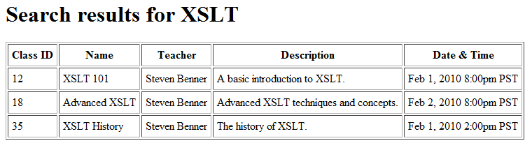

Most web <abbr title="Application Programming Interface">API</abbr>s and data feeds are built to consume and produce *<abbr title="Extensible Markup Language">XML</abbr>* data. <abbr title="Really Simple Syndication">RSS</abbr>, <abbr title="Simple Object Access Protocol">SOAP</abbr>, <abbr title="Representational State Transfer">REST</abbr>, Atom, <abbr title="Asynchronous JavaScript and XML">AJAX</abbr>, web-services, indeed, even <abbr title="Extensible HyperText Markup Language">XHTML</abbr> itself is a form of XML. If you publish anything to the web you’re probably publishing XML in some form or another. Many web developers work with some flavor of XML every day.

However few have heard of *[<abbr>XSLT</abbr>](http://www.w3.org/TR/xslt)*, a standard language adopted by the [<abbr title="World Wide Web Consortium">W3C</abbr>](http://www.w3.org/) a decade ago for styling XML data for user consumption. XSLT, or *XSL Transform*, is a real language, part of <abbr>XSL</abbr>, the *Extensible Stylesheet Language*. XSLT is a tool for reformatting XML data, literally an XML stylesheet. This powerful language lets you convert XML data into almost any other XML structure you could imagine, including completely valid and functional XHTML.

Simply put, if your web application has been built to produce XML for feeds or APIs, then you do not need to build another set of logic to make a web version. You can let web browsers hit the service, just as you would for feeds or APIs. Just create an XSLT and link it from your XML document. All modern browsers will render the XSLT and display it as a normal web page.

<!-- more -->

The most famous example of this technique in action is the [World of Warcraft](http://www.worldofwarcraft.com/) home page. Blizzard publishes a minimum amount of data in a XML document which includes a reference to an XSLT stylesheet. The XSLT takes this minimum of data and uses it to build the XHTML document in the users’ web browser. This means that instead of having a complicated and slow <abbr title="Content Management System">CMS</abbr> solution they can serve the entire (very high-traffic) home page from flat text files. When they change the content, all they need to do is publish the tiny XML file with the new data. When they want to change the look and feel they simply change the XSLT file.

This provides a nice level of abstraction between the data and the layout. Your application can focus on data, leaving the work of presentation to the XSLT.

### Applications

This technique may not be particularly well suited to your average web page, such as a company web site. Most standard web sites have no need for XML, so there is no structure to build or maintain it. But for a web application where you are going to be dealing with a lot of XML this is a great solution.

I would also argue that all XML feeds and APIs should have an XSLT stylesheet so they can render in a more user friendly view to people who want to open them directly in their browser. So if your API accepts search queries why not use an XSLT to format the results in a user friendly browser view, and add a little search form at the top.

Anywhere you send XML to the internet there is a good reason to attach an XSLT.

### Benefits

Using XSLT to support and render your XML data can have many huge advantages, especially for a high-traffic web application.

**Faster development.** Why build a whole new layer of logic and functionality? You can work on making the best XML data returns and use XSLT as your visual layer.

**Less server load.** Scripting a whole web site on top of your current data layer adds overhead. Save the servers, publish your data directly with a flat text file and let the browser handle the heavy lifting.

**More maintainable.** XSLT is basically a template. I’ve mentioned this before, but I love templates. If you want to change the look and feel of your application all you have to do is modify the XSLT files. Once you’ve gotten proficient at XSLT you will find that in many cases it is easier to modify.

### Browser support

All modern browsers support XSLT, even updated versions of IE6. The original vanilla version of Internet Explorer 6 used the *Microsoft XML Core Services* (<abbr>MSXML</abbr>) 3.0 processor for its XSLT engine. This version of the MSXML processor didn’t support the full XSLT 1.0 specification released by the W3C, it only partially support an antiquated draft. It was also simply terrible in every way. Say “MSXML 3” to an old XML guy and he’ll probably adopt the fetal position and begin rambling incoherent nonsense about the horrors he’s experienced.

Fortunately, it is exceedingly rare to find a copy of the original IE6 out in the wild. If the user has updated Windows, installed a service pack, or installed the Microsoft Office software, then their version of IE6 has been updated to use the MSXML 4.0 processor. MSXML 4.0 and up have excellent support for XSLT and are very fast at rendering it.

I don’t believe that you should ever have to worry about browser support issues. Original IE6 is the exception, and like I said, it is very rare to find such a version of this browser out in the wild today. IE5 and earlier, as well as Opera 8 and earlier have no support for XSLT, but both of those have been deprecated by their creators.

W3 Schools has a good rundown on [XSLT Browser](http://www.w3schools.com/XSL/xsl_browsers.asp) support.

### <abbr title="Search Engine Optimization">SEO</abbr> implications

The impact of the XML/XSLT system on search engine rankings hasn’t been very well researched. Google seems to be able to process XML/XSLT pages just fine. They see the rendered content in their index and will display results based on that content.

Honestly, I can’t say for sure if this system will impact your search engine rankings in a positive or negative way. I’ll do some experimentation the next time I get the chance.

### Implementation

If you already work with XML then diving into XSLT shouldn’t be that hard at all. Authoring XSLTs is notably more technical than simple HTML, but if you’re building a web application that produces XML then you must already have a good amount of technical prowess.

There are plenty of good tutorials for XSLT out there, a quick Google search will give you all of the resources you will ever need to become an XSLT master. But I will provide one example XML with and XSLT to show you what it looks like.

#### The XML

Any XML document that is valid can be rendered with an XSLT. The only item that you will need to add to the XML document is a stylesheet declaration pointing to the XSLT file (or files) that it should use for use rendering.

Immediately after the XML declaration you will add a line of code that looks like this:

```xml
<?xml-stylesheet type="text/xsl" href="/path/to/your/xslt_file.xsl"?>
```

Let’s use the following XML data for this example, a search result for the string “XSLT”:

```xml
<?xml version="1.0" encoding="UTF-8"?>
<?xml-stylesheet type="text/xsl" href="layout.xsl"?>
<searchdata>
	<query>
		<search>XSLT</search>
	</query>
	<results>
		<class id="12" name="XSLT 101">
			<datetime>Feb 1, 2010 8:00pm PST</datetime>
			<description>A basic introduction to XSLT.</description>
			<teacher>Steven Benner</teacher>
		</class>
		<class id="18" name="Advanced XSLT">
			<datetime>Feb 2, 2010 8:00pm PST</datetime>
			<description>Advanced XSLT techniques and concepts.</description>
			<teacher>Steven Benner</teacher>
		</class>
		<class id="35" name="XSLT History">
			<datetime>Feb 1, 2010 2:00pm PST</datetime>
			<description>The history of XSLT.</description>
			<teacher>Steven Benner</teacher>
		</class>
	</results>
</searchdata>
```

#### The XSLT

There is a whole language and syntax that powers XSLT, I wont bother trying to write a full guide here. I just want to provide you with a basic example to show you how it works.

One important item to note is that XSLT selectors use *[XPath](http://www.w3.org/TR/xpath/)* statements to target data. <abbr>XPath</abbr>, or *XML Path Language* statements treat XML data like a directory structure. Node values are targeted like a directory (e.g. parentNode/childNode), attributes are selected using an “at” sign (e.g. `parentNote/@id`).

This is what the XSLT for rendering it as an XHTML document would look like.

```xml
<?xml version="1.0" encoding="utf-8"?>
<xsl:stylesheet version="1.0" xmlns:xsl="http://www.w3.org/1999/XSL/Transform">

	<!-- set output mode as html -->
	<xsl:output method="html"/>

	<!-- template that matches the root node -->
	<xsl:template match="searchdata">
		<html>
		<head>
			<title>Search Results For <xsl:value-of select="query/search" /></title>
		</head>
		<body>
			<h1>Search results for <xsl:value-of select="query/search" /></h1>

			<!-- results table -->
			<table border="1" cellpadding="5">
				<tr>
					<th>Class ID</th>
					<th>Name</th>
					<th>Teacher</th>
					<th>Description</th>
					<th>Date &amp; Time</th>
				</tr>
				<!-- run the template that renders the classes in table rows -->
				<xsl:apply-templates select="results/class" />
			</table>
		</body>
		</html>
	</xsl:template>

	<!-- template that matches classes -->
	<xsl:template match="class">
		<tr>
			<td><xsl:value-of select="@id" /></td>
			<td><xsl:value-of select="@name" /></td>
			<td><xsl:value-of select="teacher" /></td>
			<td><xsl:value-of select="description" /></td>
			<td><xsl:value-of select="datetime" /></td>
		</tr>
	</xsl:template>

</xsl:stylesheet>
```

This would render the following view in your browser:

[](/misc/xslt-demo/index.xml)

Don’t believe me? Take a look at this [live demo](/misc/xslt-demo/index.xml).

### Alternative implementation

You can use XSLT on the server side just as easily as in the browser. If you simply cannot publish an XSLT for the web you can still use this technology as a template engine. You can build a separate presentation layer that interacts with your XML web service then run the transforms on the server side. Users will never see the raw XML.

Be warned however, XSLT is not the fastest template engine ever made. You will lose the speed benefits of publishing the XML/XSLT directly to the browser. For pure speed, a properly optimized PHP or .NET web application will out-perform it.

In .NET you have the [`XslCompiledTransform`](http://msdn.microsoft.com/en-us/library/system.xml.xsl.xslcompiledtransform.aspx) class, and in PHP you have the [XSL extension](http://php.net/manual/en/book.xsl.php).

### Conclusion

The example I provided above is just the most basic functionality XSLT has to offer. I hope you can at least get an idea powerful this technique is and how much time it can save you on your next (or current) web application.

There is so much value in separating your data layer and presentation layer. Maybe XSLT is the solution to all of your problems, maybe XSLT is completely useless to you. Either way, it is another valuable tool in your toolbox. Remember it is there and perhaps you’ll find that you couldn’t have lived without it.
