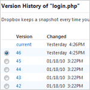

By now just about everyone knows about *[Dropbox](https://www.dropbox.com/)*, the simple file syncing/sharing and online backup solution. The software is available for several operating systems and is very fast and intuitive. It even has a good online interface so you can access your dropbox from anywhere.

But did you think about using it as a poor man’s <abbr title="Concurrent Versions System">CVS</abbr>? It’s actually a really good solution for personal projects, or for a small group of people working on a project. I have fallen in love with the service for several reasons.

<!-- more -->

### Dropbox features

**It’s free.** Your free account will give you 2GB of storage to start, if you play their new user game or viral marking game then you can easily get 3GB on your free account, which is far more than you will ever use for source code. If you do end up needing more space, they offer pay subscriptions for 50GB and 100GB, costing $10/month and $20/month. Personally, I’m sticking with the free plan.

**It’s fast.** When I am actively working on a project my changes are uploaded and synced to my other computers in seconds with no performance impact on the computers. The system works by only sending the delta so it doesn’t upload an entire file every time it changes. It is even smart enough to sync over the network so it uses the least bandwidth.

**It’s easy.** I don’t have to worry about proper commits or forgetting to check something back in at 2am, when I save the file it is automatically synced up. Sure it’s not as advanced as a real repository, but it is just so simple. After all, do you really need branch and merge on your freelance project or web design?

<figure>

</figure>

**It has versioning (kinda)** Dropbox even has a versioning system, although it’s not designed for code. You miss out on nifty diff and blame tools. But on a small project you probably already know who to blame. Unfortunately they only keep versions and deleted files for 30 days unless you have a pay plan. I really wish they’d give that out for free.

Personally, I use Dropbox as a personal <abbr title="Microsoft Visual SourceSafe">VSS</abbr> and backup for all of my projects. It is really nice to know that my work is backed up with some version info in one central location as well as distributed to all of my computers.

**It’s an off-site backup.** It is very important that you keep your hard work backed up. But just copying it to an external drive isn’t enough. You need to have an off-site backup in case something terrible happens. This is something else that Dropbox does well.

### The other option

If you don’t mind giving your code to anyone in the world who wants it, *[GitHub](http://github.com/)* is still the free code repository of choice. You’ll learn to deal with the quirks of *git* after a while, though it does have a rather steep learning curve. However, if you want to keep your code private and want to have a lot of projects, GitHub will get pricey very quickly. Since I don’t want to release the code for my personal stuff, GitHub simply isn’t worth the cost for me. My personal projects are saved on Dropbox, and my work projects are saved in the company’s VSS.

### Conclusion

For big-project work in a multi-developer environment Dropbox will certainly not replace your CVS/VSS/<abbr title="Apache Subversion">SVN</abbr>/git code repository. Having tools like diffs, branches and merges integrated into the repository is absolutely required in a corporate environment. But for one man projects or freelance work where you can’t really justify the cost or the time for managing a real code repository, Dropbox is a good choice.
