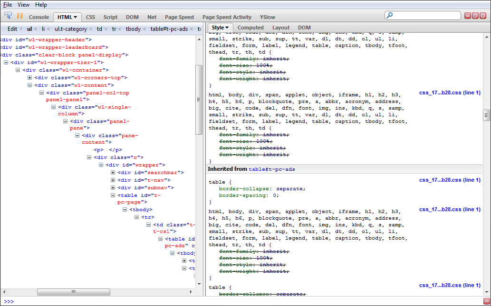

We’ve all seen them, most of us have used them, almost every CSS framework is built on one and you instantly know one is present when you open Firebug and see a hundred levels of CSS inheritance declarations. *Reset cascading style sheets (a.k.a. reset.css).*

The idea of the reset style sheet is to globally target every markup element and set all of its possible attributes to zero, default or inherit. This gives the developer a “clean slate” with no browser default styles. Many say that this is the first thing you should add when you start building a web page, but I firmly disagree.

I’m sure that I am one of the small minority of web developers who’s saying this, but reset style sheets are bad practice, and it’s time to stop using them.

<!-- more -->

### Why are reset style sheets so popular?

The trend of using a reset CSS wasn’t always so prevalent, not long ago they were practically unheard of. But in recent years the reset trend has absolutely exploded. Now every CSS framework and many large web sites use them as the base for everything they put on the web.

This happened because designers and developers were tired of dealing with the quirks of the different browsers. Just about every browser has a default set of styles that it applies to pages. 99% of these quirks could be remedied by globally setting margin and padding to zero.

However, this wasn’t enough for some. Designers working with forms and other browser/OS specific elements were tired of having to specifically reset every form element in CSS every time they started a new web site. So someone decided to make a single CSS file to specifically target and reset the CSS on every HTML element. Now all they have to do is link the reset CSS and never worry about it again.

This is quite a time saver, especially when working with forms. The technique gained popularity and eventually became a regular part of web development for many designers.

### Why is using a reset CSS bad?

I am not saying that the technique is bad, I’m saying it’s bad practice, for numerous reasons.

#### Accessibility

Many reset style sheets set *outline* to zero. Outline is an important feature for usability and accessibility. It is used for keyboard navigation.

The outline property sets an overlay border on an active/selected element that is actionable and/or has a tabindex. This gives users a visual cue as to where there active cursor is (note: tab cursor, not mouse cusor). Without the outline users who cannot use a mouse or who choose to use the tab function to navigate pages can’t see where their cursor is. This effectively makes the page unusable for some disabled people, and less-usable for tabbing power-users.

#### Unnecessarily large style sheets

There are certain display standards and conventions that all browsers agree on by default. Headings are bold, links are underlined, lists have bullets, etcetera. When using a reset style sheet you have to manually set every single display property for every single element.

Why would you want to repeat the same CSS that every browser gives you by default? It only clutters your style sheet, increases download footprint and slows the browser rendering engine.

#### Inefficient inheritance and slow rendering

Styles are not simple text properties that are built into your operating system, they are rendering statements that are passed to a large and complicated rendering engine in the browser. This rendering engine must read all of the CSS and build the display rules for the entire page before it will even show you the content.

The browser default styles that reset style sheets are trying to kill will be the foundation of the inheritance tree regardless of what styles you put on top of it. So the rendering engine must add your rules on top of the reset rules, on top the default display rules. As a CSS coder it is your job to optimize your CSS to make this as fast and easy on the rendering engine as possible.

For example: you want `h1` tags to be bold.

 * Without a reset CSS you do not have to add any statements to accomplish this effect, it is part of the browser default. So the rendering engine only has to process the already optimized and compiled default to give you this effect.

	```
	h1 { font-weight: bold; } /* Browser Default */
	```

 * With a reset CSS you will be sending not only the `h1` reset, but probably the div, body and html reset along with your override, `h1{font-weight:bold;}`. So the rendering engine sees an inheritance tree that looks something like this:

	```
	h1 { font-weight: bold; } /* Browser Default */
	html {
		font-weight: normal;
		body {
			font-weight: normal;
			h1 {
				font-weight: bold;
			}
		}
	}
	```

You can actually see a view of this when you are looking at the CSS information in Firebug. This is a whole lot of extra work for the browser to have to work through to create your styles. Even if you didn’t want the default bold `h1` then it would still be far more efficient to put `h1{font-weight:normal;}` in your CSS without the reset. After all, the default target is specifically overridden and the engine does not have to process the extra inheritance information.



Worst-case scenario with reset CSS.

The image above is an excellent example of what I’m talking about. It’s a worst-case situation where bad markup, bad styles and a reset CSS have all come together to produce a monstrosity. This is a real site that I’ve had to work on. Notice the scroll bar on the style list, because of the outrageous inheritance tree this one element has 30+ self-overridden reset selectors applied to it.

Granted, this example is an extreme case, however the effect is the same even when the site has excellent markup and well designed CSS.

#### Maintainability and debugging

I am a dedicated Firebug user. I love the tool and I simply cannot live without it for CSS development. But I hate working on pages that have reset styles because they clutter up the interface and I have to scroll through countless overridden selectors to find the one that is applied in each case.

#### Transmission footprint

A reset style sheet is yet another CSS file and a couple hundred more bytes that the browser has to download. The single most important aspect of web page and server optimization is reducing download size and reducing the number of connections needed to send a single page.

Page optimization is why we use image sprites and minified/combined include files now. Every connection and byte of data that you can remove will make your site faster and scale better. A large majority of the time spent downloading a web page is spent on the latency and over-the-wire transmit time for page dependencies and resources.

Take this very seriously, development on a high traffic web sites is all about shaving every millisecond and every byte you can because you will be able to support that many more simultaneous users.

### That was a very long-winded rant, so how do you deal with it?

Simple, the way we’ve been doing it since we stopped using tables and 1px separator gifs.

```css
* {
	margin: 0;
	padding: 0;
	/* possibly border: 0 */
}
```

This single statement at the top of your style sheet will give you almost the same effect as a reset style sheet with almost none of the drawbacks or performance degradation.

Asterisk is the global selector, it will target everything, regardless of type, standards or validity. It is also an efficient rule (when used on its own). Most rendering engines will understand that an asterisk select means *everything*, regardless of inheritance. So it doesn’t process it as an inheritance, it is simply attached to every element.

It is worth noting that asterisk when joined with another selector (e.g. `#navigation *`) is actually an inefficient selector because it does have to process an inheritance tree.

### Conclusion

I understand that there are times when a reset CSS can be an asset, such as rapid prototyping and very extreme/artsy designs where you would have to override everything anyway. However for the sake of performance optimization and general best practices you should avoid reset style sheets.
