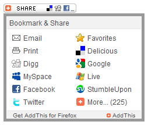
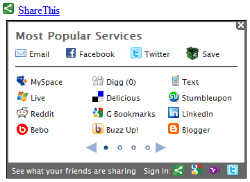
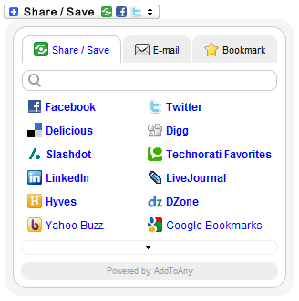
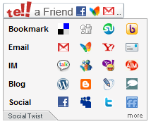

Social bookmarking widgets are absolutely everywhere, you see them on blogs, news, online retailers and even on government web sites. They have become one of the defining features of Web 2.0 design.

There are three major players in the social bookmarking widget world, [AddThis](http://www.addthis.com/), [ShareThis](http://sharethis.com/) and [AddToAny](http://www.addtoany.com/). These three services together are seen by almost everyone on the internet every single day.

This begs the question, which one is best? As usual it depends on what your needs are and how you will be using it. However I’ll try to take away the dartboard selection process that you’re using now by providing some reviews and a performance comparison for these different services.

<!-- more -->

### Performance chart

I started off by creating pages that contain absolutely nothing but the widget. With these completely empty pages I can get a much more accurate reflection on load time. I used Mozilla Firefox with the Firebug, YSlow, PageSpeed and Tamper Data add-ons to to determine the number of connections, load time and weight for each widget. These are some of my [recommended Firefox add-ons for all web guys](/2010/01/must-have-firefox-add-ons-for-web-developers-designers/).

All of these tests are using the default button with the default settings for each service. I ran all of these tests from two locations in northern California. One set was run from my home 6Mbps <abbr title="Asymmetric Digital Subscriber Line">ADSL</abbr> connection and another set is run from my dual 30Mbps <abbr title="Digital Signal 3">DS3</abbr> work connection. The results were basically the same from both locations. Both computers were Intel Qxxxx quad core systems with ample power.

These tests are not necessarily what you would expect average users to see but they offer a good comparison between the performance factors for each service.

The following table contains a breakdown of major points that I tested:

|                         | AddThis | ShareThis | AddToAny | Tell-a-Friend |
| :---------------------- | :------ | :-------- | :------- | :------------ |
| DNS Requests            | 2       | 6         | 3        | 2             |
| Initial HTTP Requests   | 5       | 18        | 6        | 3             |
| Initial Weights         | 20.7KB  | 82.6KB    | 20.9KB   | 12.5KB        |
| Initial Load Time (avg) | 460ms   | 1.69s     | 525ms    | 477ms         |
| Total HTTP Requests     | 14      | 21        | 8        | 6             |
| Total Weight            | 71.3KB  | 82.8KB    | 47.8KB   | 22.8KB        |
| Total Load Time (avg)   | 1.52s   | 2.34s     | 538ms    | 886ms         |
| Window Load Time (avg)  | 490ms   | 460ms     | 485ms    | 480ms         |
| Cookies                 | 10      | 5         | 0        | 0             |

Let me first take a moment to explain exactly what these values are. The *initial* items refer to the resources required to just display the widget button on the page, the *total* requests include the content loaded when you put your mouse cursor on the widget

 * **DNS Requests**

	The number of specific domains and sub domains that must be resolved to load the widget. Lower is better, but in the real world most users will already have these <abbr title="Domain Name System">DNS</abbr> entries cached in their browsers, especially AddThis.

 * **HTTP Requests**

	The number of connections and independent client/server interactions that have to be made to load and render the widget. The *initial* requests will delay loading the rest of your page.

 * **Weight**

	The download size of all of the scripts, <abbr title="Cascading Style Sheets">CSS</abbr> and images needed to display the content you see on the page. Again, in the real world you can expect much of this to be cached.

 * **Load Time**

	The average time it takes to connect and download all of the content for the widget.

 * **Window Load Time**

	The average time it takes before the `window.onload` event fires on my test pages with no cache. This is not execution time, it is just a point of reference that includes execution time.

 * **Cookies**

	The number of cookies that the widget and/or its servers will set and force the browser to send back every time it makes an HTTP request. These add to the weight of the widget, but are not counted towards the weight in this test.

All of these services fail the YSlow and PageSpeed recommendations in some way or another. They have to sacrifice some cache performance for the ability to update the code on their end without requiring every publisher in the world to update the code on their site.

### AddThis

<figure>

<figcaption>AddThis Widget</figcaption>
</figure>

By far the most popular social bookmarking widget on the internet today, AddThis sets the standard that all of the other bookmarking widgets try to live up to. They have the largest user base, a massive collection of supported service, lots of display flexibility and have localized their widget into more than 50 languages. They also support <abbr title="Secure Sockets Layer">SSL</abbr>.

I have [voiced some concerns](/2010/02/addthis-friendly-widget-and-brilliant-viral-tracking-scheme/) about AddThis using some black-hat user tracking and profiling tactics. However, since they are so popular this service must get some love in this review.

#### Try it

#### Customization

The AddThis widget is also the most flexible in terms of layout and design. There are several basic templates and styles to choose from and the JavaScript that runs the widget supports numerous customizations. With a little CSS trickery you can completely control the look of your widget.

#### Performance

This widget scored very well in the performance testing for initial load, with low initial download and only 4 initial HTTP requests. However it has the second largest total download weight when your mouse crosses it with a total of 71KB of script, CSS and images.

#### Thoughts

I do like the look and feel of AddThis and love the extra levels of customization you get with this product. They have good documentation and have good performance. They’ve recently added clickback analytics which is a very nice feature indeed. Saves you the time of building bit.ly links and integrates click tracking back in to the analytics system.

If you care about your visitors privacy, do not use AddThis, the primary reason this widget exists it so mine data. They use black-hat tracking tactics and their privacy policy says that they can resell the data to anyone who wants it.

### ShareThis

<figure>

<figcaption>ShareThis Widget</figcaption>
</figure>

The second most popular social bookmarking widget out there is ShareThis. The ShareThis widget is not as flexible as the AddThis widget and can be very difficult to customize beyond their widget creator. But it has other strong points. The ShareThis widget is supported by a service that users can sign up for. People logged into a ShareThis account will see their favorite social sites at the top of the widget. This is a pretty nice feature, for people who decide to sign up.

#### Try it

#### Customization

You can customize a couple levels display with a few different display options. You can of course choose and order the social site links that display in the hover view. However since the popup menu is displayed via an `iframe` there is absolutely no way to change the look and feel other than the very basic controls you get in the widget creator.

#### Performance

Unfortunately ShareThis has done quite poorly in the performance test. It has the largest initial download weight (by far) and the most initial HTTP requests. The initial weight is a whopping 83KB! Most of the initial weight comes from one large sprite and the MooTools JavaScript library. The sprite is fine, a JavaScript library is not. Granted both of these items will cache well, but you should not build a simple little widget on top of a JavaScript library, it’s a huge dependency that is 95% wasted on this product.

It takes a total of 18 HTTP requests to get the widget if the user does not have it in browser cache. Since it is so popular many people will have it cached but these requests will delay the loading of your page.

What really hurt was the initial load time. I should point out that the load time is skewed by the Google ad services and analytics calls that the script calls. It will render and display before the 1.69 second average initial load time, but since I tested load time not render time I have to factor in the tracking and ad code.

ShareThis sends two logging `GET` request as well as an <abbr title="Asynchronous JavaScript and XML">AJAX</abbr> `POST` request when it opens the sharing dialog, the ShareThis server requests tend to take around 220ms each which hurt the total load time even more. The Google analytics request only takes 45ms, which is the kind of speed they should be shooting for if they want this extra logging.

In my opinion even through the loading time doesn’t really reflect the render time, they still deserve a bad score because of this unnecessary logging and fat weight. Do you really need two separate logs every time someone happens to mouse over the button? Do you really need any?

#### Thoughts

Aside from their overzealous logging, ShareThis was actually quite a good contender. The widget has a good look and good functionality. However, the bad load time and the lack of customizations hurt.

### AddToAny

<figure>

<figcaption>AddToAny Widget</figcaption>
</figure>

The AddToAny brings a couple nifty features to the table that are quite nice, it tracks how many shares a particular page has for each service and shows them in the Share / Save list.

They also have a “personalization” feature that displays services that individual visitors actually use up top. This is rather dubious because if they are doing what I think they are doing, then they are exploiting a security hole in the browser. Regardless, it is conceptually a brilliant feature that can be very useful.

#### Try it

#### Customization

The button itself is an image tag, so it’s easy to change that to anything you like. The widget creator lets you change the colors, but that’s about it. However, since the popup menu is not in a `iframe` you can control it’s look with CSS. The markup is well structured and has good `id` and `class` identifiers. Their <abbr title="Application Programming Interface">API</abbr> offers some additional customization elements as well.

#### Performance

AddToAny did very well in the performance testing. It has the second highest initial weight, but that is due to one huge sprite with every logo imaginable. Its initial load time was right in the middle, not super-fast, not slow. However it had the fastest average total load time. The performance is fast and it is consistent. I had to give it 3 DNS requests because that’s how many it takes to load it, however one of those DNS requests is google-analytics.com, which basically every person on the internet will already have cached before they ever reach your site. Overall, the performance was very good.

#### Thoughts

If you ask me the popup share view is way too big. The bookmark tab is not very useful, in Internet Explorer it gives you an “Add to Favorites” button, but in every other browser it simply says “Press Ctrl+D or ⌘+D to bookmark this page”, there isn’t much point. The search form? Why is it there? Who will search for their social site? If you press that little down-arrow under the social links it will display every social site that has been enabled. With the default settings this is a massive list which can mess with your site layout if you don’t expect it.

### Tell-a-Friend

<figure>

<figcaption>Tell-a-Friend Widget</figcaption>
</figure>

The Tell-a-Friend widget from SocialTwist is the least known bookmarking widget in this review, but those who use it tend to like it so I felt they deserved a place in this article. Of all the widgets I’ve been giving serious consideration to, this is the only one with a pay version. There is of course a free version but the pay version does have several features that power users will want. It would seem that the primary focus of this widget is branding control for the client. You don’t get these advanced features in the free version so I cannot give you more details, but they have acquired some rather large clients (Disney, Barnes & Noble, Kraft Foods, etc.) who use the more advanced branding features.

#### Try it

#### Customization

The widget customization is pretty much limited to what you can build in the widget creator. The button itself is an `img` tag so you can replace that quite easily with any image you want. This widget doesn’t use an `iframe` for the hover windows so you can do a little bit with CSS, however the social media icons are inline styles so they cannot be changed.

They offer more customization in the pay version, but I wasn’t willing to shell out any cash for this test so I can’t comment on the quality or any additional flexibility.

They chose to go a different direction for the bookmarking and sharing functionality. When you click on an icon to share the widget opens a kind of large modal over the page, instead of simply clicking an image and getting redirected to the share form on the social site. This feature is part of their branding focus which allows paying clients to customize the sharing screen. But it absolutely dominates the window once it opens.

#### Performance

Surprisingly, the Tell-a-Friend widget was the one of the best in the performance comparison. It had the lowest initial download weight and the second fastest average initial load time. The images are served from a different sub domain than the JavaScript, they could literally cut their DNS lookups in half by putting the images and JavaScript on the same CDN sub domain. But I can’t really complain about 2 DNS lookups. For some reason their script seems to have the longest execution time, average `window.onload` fires around 100ms later than AddThis or ShareThis.

The performance tests did not take into consideration the modal window. Since you have to take an action to open the window I didn’t feel it needed to be rated for performance. However I do want to note that it is quite large, with lots of scripts, CSS and images.

#### Thoughts

Tell-a-Friend is the only TRUSTe certified widget. They seem to have the best privacy practices.

 > “We take user privacy very serious. We do not profile users, store any personal information. Even the address book feature, others “import” we only let users view.”

Indeed, they don’t do any cookie based tracking and their low weight and fast response suggest that they are not doing any profiling on the back end. When it comes to user privacy they seem to be the winners.

I understand why they have a pay system in place, it’s the only business model that works for them. Unfortunately their free implementation feels like they’ve had to do extra work to reduce the usefulness of their product. The basic vs detailed analytics, not offering button customization and not offering modal customization. It all just feels too forced, especially when their competition is offering all of those features and more for free.

Personally, I refuse to enter my Twitter login information anywhere other than Twitter or my Twitter desktop application. However if you want to share to Twitter via the Tell-a-Friend form you will have to enter your login information. It asks you to login to share for several other services as well. I can see this stopping many users dead in their tracks.

### Features chart

All of the services that I’ve tested include support for just about every social media site ever made. Since I haven’t used every social media site ever made I can’t comment on the ones they are missing, however I will say that they all support every social media site you care about.

Every service also has it’s own integrated analytics system. All of these analytics systems are pretty good with pretty much the same metrics (shares, locations, services used, etc) and are easy to navigate. All except for Tell-a-Friend can support Google analytics integration and none except for ShareThis can support Omniture integration.

|                              | AddThis | ShareThis | AddToAny | Tell-a-Friend |
| :--------------------------- | :------ | :-------- | :------- | :------------ |
| Every service you care about | ✔       | ✔         | ✔        | ✔             |
| Language Localization        | ✔ (55)  | ✔ (5)     | ✔ (51)   | ✔ (18)        |
| Analytics                    | ✔       | ✔         | ✔        | ✔             |
| Google Analytics             | ✔       | ✔         | ✔        | ✘             |
| Omniture Reporting           | ✘       | ✔         | ✘ (?)    | ✘             |
| SSL Support                  | ✔       | ✘         | ✔        | ✘             |

To be honest I never found any value in having the ability to share SSL pages, but it has been a deciding factor for some people. Really, why is a page that you want to share with everyone behind a secure connection?

### Other mentions

 * [OnlyWire](http://www.onlywire.com/) is another social bookmarking widget service that wants to play with the big boys. Unfortunately their free version has ads and I don’t think anyone will accept ads on their site just for a bookmarking widget. It also blew the performance tests with 42 initial HTTP requests and an initial weight of over 100KB.
 * [SocialList](http://sociallist.org/) is a super-simple bookmarking widget. It doesn’t have analytics or any creation interface and near as I can tell it hasn’t been updated in over a year. But it is small and simple, so it does deserve a mention.

### Winners

Of course each widget is better in different areas, so I can really only compare them with the performance tests and features.

#### Best performance – AddToAny

This was a difficult choice. For initial load performance Tell-a-Friend won for having the lightest weight, least HTTP requests and fastest response. But they failed the overall widget performance test because their form system is just so big and heavy. AddToAny wins the best overall performance despite having the heaviest total weight of all the widgets. Most of that weight is from a 26.8KB sprite with every logo ever made. But it caches well and does not seem to hurt performance.

#### Most customizable – AddThis

AddThis wins the customization contest hands-down. In some ways AddToAny is as good or better, but because of their “Toolbox” and list layouts you really can get a very good level of control over how the widget renders. They have more standard buttons and layouts than any of the other services and have more customization features.

#### Best end-user privacy – Tell-a-Friend

Of course, Tell-a-Friend with their decent privacy policy and lack of profiling wins the privacy competition. Most webmasters don’t concern themselves with matters like this, but internet privacy is something that I consider very important. As much as I want to know who you are, I don’t presume the right to know everything about you just because you viewed my site. At the same time servers and dark-fiber ain’t cheap, and I need to make money off of you somehow.

### Do you really need a bookmarking widget?

Before you go implementing one right this moment; please take a moment to ask yourself, do you really need a social bookmarking *widget*?

There are literally hundreds of social media sites out there, most of them you have never heard of and neither have any of your visitors. If your site serves a particular niche then it should be easy to identify the social media sites that you need to target. Just put up a couple icons and links. This will make your site load faster and make it easier to follow your presence on those social media sites. If someone wants to link your site on a social media service then not having a widget will not stop them.

If you do need to have an easy link for more than just a few social media sites then perhaps you do need one of these widgets.

### Final thoughts

Any of these widgets are good choices, depending on your needs. Personally, I think AddThis has the best look and feel, but I hate their [aggressive tracking strategy](/2010/02/addthis-friendly-widget-and-brilliant-viral-tracking-scheme/). I like the look and functionality of ShareThis but it’s too fat and users have to register to get the most out of it. AddToAny has good performance and is intuitive, but it is just so big. And Tell-a-Friend has nice branding tools but their big modal window is a bit cumbersome and it feels neutered unless you pay.

If I had to pick a widget right now it would probably be AddToAny, with a lot of thought given to AddThis.

**Update (<time datetime="2010-03-16">3/16</time>):** Re-tested all widgets and updated all of the performance numbers. Updated AddToAny customization information. Added thoughts on Tell-a-Friend privacy.

**Update (<time datetime="2010-03-19">3/19</time>):** Update language localization information. Added SSL support.
