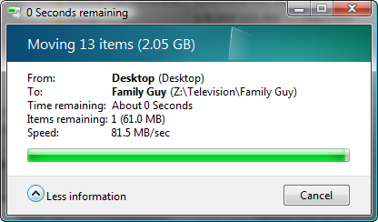
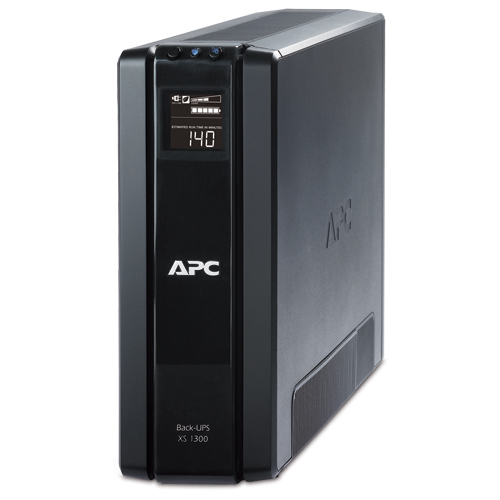
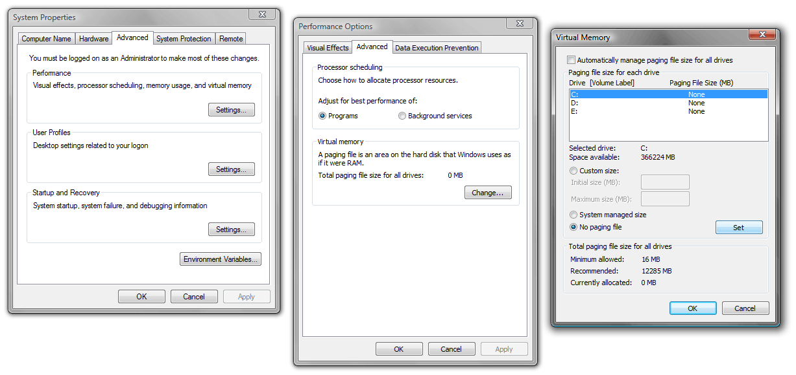

It’s taken me a quarter of a year to write this series, partially because I wanted to make sure I got it right, partially because I’m a lazy writer. But now the wait is over, here is the third and final installment of the series about my home NAS server build. The previous installments are [Part 1: Hardware](/2009/12/building-a-home-network-attached-storage-server-part-1-hardware/) and [Part 2: RAID Setup](/2010/01/building-a-home-network-attached-storage-server-part-2-raid-setup/).

In this article I will discuss the final garnishing that you need to do to get you NAS to fire and forget server status. I will also give you my reviews of the various pieces of hardware that I used and offer a general wrap up statement on the project.

<!-- more -->

**80MB/sec across the network!**

### Surprises

During the course of building and using my NAS I discovered a couple of interesting things that I was not expecting to see.

 * **Drives spin down:** I was quite surprised to see that the drives on the ICH10R will power down. This was not something that I was expecting, but was happy to see. Just setting the regular power controls in Windows will allow your system to turn off the hard drives when they haven’t been used for a while. Doing this will not only save your electric bill, but will also increase the life span of the hard drives.
 * **Full network saturation:** To be honest I was expecting 40-50MB/sec, and I would have been able to live with that. However I often see network transfers moving at 70-80MB/sec! Fully saturating my gigabit network. Of course a lot of this speed is due to the SMB2 performance, so don’t expect to see these speeds on XP or Linux machines.
 * **Low power consumption:** The whole system only consumes 68 watts when the hard drives are powered down and the server is just sitting idle. I can probably reduce this even further with an undervolt and more aggressive power saving, but it isn’t worth the trouble. I sleep quite well knowing my NAS is costing me less than that light I left on in the kitchen.

### Final tinkering and optimizations

Before we walk away and call the server done we should take care of a couple small items that will help keep the server up, running and problem free for a very long time.

 * Add a UPS with a decent battery backup time
 * Disable the swap file
 * Set up RAID notifications

### Add a battery backup

<figure>

</figure>

Running the file server off of a [UPS](https://en.wikipedia.org/wiki/Uninterruptible_power_supply) *(Uninterruptible Power Supply)* is perhaps the single most important thing you can do. I would say this is not only necessary, but absolutely required for this kind of RAID server. If you run your server simply plugged into the wall then you are placing your data at great risk. A risk that can be all but removed by spending $50-$250 on a UPS.

A good battery backup can make the difference between a fully functional system and an instantly corrupted RAID array. If the power on the system were to fail during a parity write then the RAID array could be corrupted, i.e. *catastrophic data loss*.

This bears repeating: **Do not run a NAS with a RAID setup like this one without a good UPS!**

Really, the choice of UPS isn’t all that important so long as it has a data connection that Windows Vista has native support for. Any somewhat modern UPS with a USB connection should do fine. You should be able to just plug the UPS USB cable in and Windows will recognize it as a battery. For the record I chose the APC Back-UPS XS 1300 (second generation) because it was a quality UPS that was available locally.

The bigger the battery the better, but you’re not going for length of run time, you just want a nice thick buffer of power for when there is a brown out or extended black out. I would recommend 1000VA or better, but you could probably get buy even with a 500VA so long as you’re not running a monitor and a bunch of peripherals. Go as big as your budget allows.

#### Configure the system to automatically power down

You want the server to automatically turn itself off (safely) if you are experiencing an extended black out or brown out. To do this we will configure Windows to shut down when a low battery status is detected. Here is a brief walk-through for Windows Vista:

 1. Open up the *Power Options* from the Windows Control Panel.
 2. Click the *“Change plan settings”* link under your current power plan.
 3. Pick an appropriate time for sleep.
 4. Click the the *“Change advanced power settings link”*.
 5. Under the Battery controls (at the bottom of the list), set both *Low battery action* and *Critical battery action* to *“Shut Down”*. Also verify that the Low battery level and Critical battery level setting are appropriate for your UPS.

The default battery level settings should be fine for 1000VA or better, but if you’re running an underpowered battery jack these values up to 70-80% because a small battery will run out much faster and you want to leave ample time for the system to shut down.

That’s it for settings. Your server should automatically shut down when there is a power failure without any assistance, even if you’re far away from home. When you are at home you will surely hear your UPS screaming at you if there is a power failure. If you’re there then go ahead and shut the server down, don’t take any risks with your precious data (and quiet that loud alarm).

A note on power actions: I believe that hibernate and sleep should also protect your RAID array, but I don’t know enough about the inner workings of these functions to say for sure. All you are trying to do is to get the drives to finish any current I/O activity and power down safely.

The only time a power failure can damage your system is if it happens during a parity **write**. So if you’re in the middle of a wind storm and see your lights flickering, do yourself a favor and do not save a bunch of files to the NAS.

#### Test it

Once you’ve got your UPS charged and running you should do a little test to verify that it is all correctly configured and working properly. Make sure that no one will be writing to the NAS for a while (or just unplug the ethernet), also make sure all of the drives are fully powered up and spinning. Then unplug the UPS from the wall.

 * Verify that it instantly switches to battery power and the system stays up an running.
 * Verify that the system automatically powers down according to your settings.

### Disable the swap file

We want our hard drives to last as long as possible, the way we do that is by keeping disk I/O to a minimum and powering down the drives when they’re not needed.

The first thing we can do to lower I/O is to disable the *swap file* (a.k.a. the *paging file*). In case you’re not familiar with this, the swap file is basically on-disk RAM for the operating system. If you have it enabled then Windows is always pinging the drives for the extra memory.

If you’re running Windows Vista then **you should have at least 4GB of RAM before you disable the swap file**. Without the benefit of virtual memory the system will crash if you max out your RAM, which could put your data at risk. So skip this step if you’re only running 1 or 2GB of RAM.

Disabling the swap file will not only greatly decrease disk I/O, but it will also improve the performance of your system because it forces Windows to use RAM for its temporary storage, which is about ten-bazillion times faster than hard drives.

**To disable the swap file in Windows Vista:**

 1. Open “System” in the control panel
 2. Open “Advanced system settings”, on the left menu in the System screen.
 3. Under the “Advanced” tab, click the “Settings” button in the “Performance” section.
 4. Click the “Advanced” tab.
 5. Click the “Change” button in the “Virtual memory” section.
 6. Select the “No paging file” option and click “Set”.

The screen shot above shows the windows and configuration settings that you want to disable your swap file in the Microsoft Windows Vista operating system.

### Setup RAID notifications

Something that is woefully missing from the Intel Matrix RAID controller software is notifications. Sure, it will pop a little message on the desktop, but I don’t spend much time looking at the desktop on a machine that doesn’t even have a monitor.

No, what you need to have is email notifications, throw on some SMS and maybe a small fog horn for good measure. However for this article I will only cover email notifications and skip the instructions for setting up SMS or a fog horn.

Now as I said, the Intel Matrix software doesn’t have any way to send notifications, however, it does post events to the *Windows event log*, and the Windows event log *does* have the ability to attach actions to log events. So let’s use this feature which comes with Windows.

#### RAID event log information

Whenever a RAID event occurs a message will be sent to the Windows event log. These events are logged on the *Application* log as a message from the *IAANTmon* source. The events that we’re looking for (RAID events) are given the *Warning* level. This is all of the information we need to attach an action.

The big thing we are looking for is when a RAID array goes from “Normal” status to “Degraded” status. This means that a hard drive has failed and the array is in it’s emergency status, working hard to keep the data available but on the verge of total data loss.

A Degraded notification is logged with an event ID of 7202 (on my system, may be standard but I can’t say that for sure). Here is an example of the first couple lines of such a notification:

 > Status for volume ‘Data’ changed from ‘Normal’ to ‘Degraded’. \
 > System Report:- \
 > Intel RAID Controller: Intel(R) ICH8R/ICH9R/ICH10R SATA RAID Controller \
 > Number of Serial ATA ports: 6

When you see this message you should be very concerned and do everything possible to replace the failed hard drive. The information that follows this message will give you the details of all of the drives so you can identify which SATA port has the failed drive.

#### Attaching actions to Windows events

Creating a task that will be run whenever this event happens is really easy, it’s built right in to the event system. It even has a “Send email” feature, unfortunately it is really dumb and requires a simple SMTP server which doesn’t require a log in. If you have such a SMTP server (possibly from your ISP) then you can use this feature and call it done.

If you do not have access to an SMTP server that doesn’t require authentication then you will need to find another way to send messages. In my case I created a little program that uses my gmail account. I’ll post more on this and provide a download in another article.

### Hardware reviews

I have now logged 3,000 hours of up-time on this machine and feel qualified to review the hardware that I picked. Overall, I am exceedingly happy with my investment, but I still wish I had been able to spend the money on a hardware RAID controller. Not for performance mind you, this system still completely saturates my gigabit network, but for peace of mind, rebuilds take a long time with the ICH10R.

#### Antec 1200 computer case

This case has been wonderful for the NAS server. I love how the hard drives and internals stay cool and clean. Taking the filters out for cleaning is a bit annoying but I can live with that. Overall I’ve been very satisfied with this case.

#### Seagate Barracuda LP ST32000542AS 2TB Hard Drives

The price that I paid and the vast storage capacity has made these drives a great choice. I purchased six of them and all of them are still working fine to this day. It seems that the reports of DOAs have been greatly exaggerated. Just goes to show, people are 50 times more likely to leave a negative review when something goes wrong then they are to leave a positive review when everything works fine.

#### Western Digital Caviar Black hard drives

Fine drives, they work well, were reasonable priced and are still chugging along. But everyone already knows that WD makes good hard drives.

#### Gigabyte EP45-UD3R motherboard

The first one I got was DOA, it would try to boot, fail and reboot over and over. Apparently this was a common occurrence with these boards. The second one I got worked fine, however two of the CPU pins were slightly bent. I don’t know if it was something that happened at the factory or during shipping, but they were easily repaired with a pair of needle-nose pliers. Other than those issues the board has been working great.

#### APC Back-UPS XS 1300 (second generation)

APC has a long history of making good UPS systems and supporting them for a very long time. You can probably still purchase replacement batteries for a UPS that you bought from APC 10 years ago.

I chose APC because I have had good luck with them personally, and I chose the second generation Back-UPS XS 1300 because it was a high quality system that I’ve used before and was available locally. These can be quite heavy so I didn’t want to pay shipping and I didn’t want to have to do a mail RMA if I had the bad luck of getting a dead one.

The XS 1300, as it’s name implies, is a 1300VA UPS, which is more than enough juice for my low-power NAS. I can get well over 30 minutes of battery run time on this unit and it has a nice LCD screen that reports load (wattage and percent) as well as estimated run time. It has AVR *(Automatic Voltage Regulation)* which is a feature I would recommend. AVR keeps the voltage constant during a brown out which will help protect sensitive (and expensive) computer components. It also looks good, a tall and slim black unit that looks great sitting next to the Antec 1200.

This is a quality unit and I am happy to give it a big thumbs up.

### Conclusion

This has been a great project and I have received an absolutely amazing file server for my time, effort and money. I leave this machine on 24 hours a day, 365 days a year and use it for all of my file storage. It’s wicked fast, has massive storage capacity and doesn’t even seem to hurt my electric bill.

Since I started this project the Intel i5/i7 processors and motherboards have come down in price a lot, but have yet to completely replace the old Core 2 series. If anything the Core 2 series is an even better deal today and I would still recommend building your home NAS on that platform.

I hope that this series of articles will be of some help to anyone out there looking to set up their own file storage solution. Please, if you have any questions leave them in the comment field below and I will answer them to the best of my ability.
