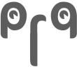

The whole world knows about the so called *“Great Wall”* that protects the Chinese people from dangerous western ideals, the serious concerns about internet privacy in the United Kingdom, now we have Australia making a real push towards [internet filtering legislation](http://www.guardian.co.uk/world/2010/mar/29/google-yahoo-australia-internet-filter) as well as all of North America and most of Europe signing on with the *[ACTA](https://en.wikipedia.org/wiki/Anti-Counterfeiting_Trade_Agreement)* legislation. Of course we still have [Iran blocking news, social media and even gmail](http://online.wsj.com/article/SB10001424052748704140104575056972514372994.html). But even countries that we wouldn’t expect to support censorship are signing bad legislation, such as [France](http://www.theinquirer.net/inquirer/news/1591582/france-falls-internet-censorship), [New Zealand](http://www.neowin.net/news/main/09/09/14/new-zealand-to-get-country-wide-filtered-internet), and [Ireland](http://www.irishtimes.com/newspaper/frontpage/2009/0820/1224252952116.html).

For at least a decade the very idea of filtering information was something first world countries laughed at as a tactic only dictatorships and xenophobes would seriously consider, now it seems the stage is changing and governments and ISPs are becoming more open to the idea of national censorship.

This is a terrible, and dangerous trend. I for one hope the aussies block the forced internet filtering law and I hope the whole world sees ACTA as the scam that it is. There is a quote that I often like to cite when the topic of internet filtering comes up, *“The internet sees censorship as damage, and automatically routes around it”*. Unfortunately, when censorship happens at the ISP level, that automatic routing is broken, so you have to do some manual routing to circumvent the broken tubes.

I think it is important to know how to get around censorship schemes and I believe that the greater the number of people with this knowledge the better off the internet, and the world will be. So here’s how to circumvent internet censorship, the *VPN*.

In several countries it is illegal to even attempt to circumvent government authorized internet censorship. You can and will go to jail if you get caught bypassing official filters in such countries. As much as I want to promote internet free speech I do not want any of my readers to go to jail. Please read up on your countries laws regarding net filtering and, of course, I do not advise you to attempt anything illegal.

*Disclaimer: This site is not intended for distribution to, or use by, any person or entity in any jurisdiction or country where such distribution or use would be contrary to local law or regulation.*

### VPN tunnel through a country that supports internet freedom

The idea is simple, do your internet surfing through a *VPN* tunnel that ends in a country that has a good record of supporting a free internet and protecting privacy (such as Sweden).

### What is a VPN?

A VPN (or *Virtual Private Network*) is a way to securely extend a private network across the internet to another location. The client computer (in this case your computer) makes an encrypted connection to a server which acts as a normal network connection. This technique is commonly used at tech companies to allow employees to connect to their work network from anywhere in the world so they can access files on the corporate network or even open a remote desktop connection to their office computer.

This system is very secure. Since VPN users don’t want any nefarious types or compromised systems along the way to be able to sniff out what files you are reading or what information you are sending, hence “Private”. When a VPN connection is open it is just like having an Ethernet cable connected to the other machine, just slower since it is going over public networks.

### Sounds great! So how do I get a VPN?

<figure>

</figure>

It’s not free, but it is cheap. There are actually several companies offering this service already, such as [PRQ](http://prq.se/?intl=1) which offers an [OpenVPN tunnel service](http://prq.se/?p=tunnel&amp;intl=1) for as little as $10 per month. There, your VPN server is all ready to go! I mention PRQ only because they are famous for protecting their customers, for more VPN providers check out the [VPN list](http://en.cship.org/wiki/Virtual_Private_Network) on the Internet censorship wiki.

You can also set up a VPN server of your very own anywhere you like, but you will need to find a host to house the system and keep it online. I highly recommend a VPS (*Virtual Private Server*) system for this because it is cheap, fast and you don’t need much computing power to run a VPN. Of course a dedicated server is fine too, but a lot more expensive. No matter what you will need a system that gives you root access so you can install and configure the VPN server.

### Alright, I have my VPN server! Now, how do I use it?

Making a VPN connection is easy with [OpenVPN](http://openvpn.net/), and even easier with a Windows Server VPN. For this article I’ll assume you are running OpenVPN because a Windows Server VPN would be prohibitively expensive for a home user who just wants to browse the internet in peace. I will also assume you are using the Microsoft Windows operating system (because that’s what I use). If you are a Mac or Linux user you’ll find similar guides with a quick Google search.

The first thing you need to do is to download a copy of the [OpenVPN GUI](http://openvpn.se/) for Windows. This is a free application and the Installation Package includes everything you need, even the base OpenVPN software.

If you are getting your VPN access from a company that provides OpenVPN services then you should receive all of your configuration information from them. If you’re setting up your own VPN server then you will need to read the OpenVPN documentation for your particular system.

The guide for setting up your VPN will be the topic of another article, I’ll write up a nice how-to with screen shots and such eventually. For now, if you’re looking fo a good walk-through on setting up the OpenVPN GUI check out [How to configure OpenVPN](http://www.itsatechworld.com/2006/01/29/how-to-configure-openvpn/).

### The other option

I believe that a VPN system like what I have described is the best solution because it is fast and nearly impossible to eavesdrop on, however it isn’t the only solution.

The simplest option is the good old fashioned *[proxy server](https://en.wikipedia.org/wiki/Proxy_server)*. A proxy server, as it’s name implies is a server that bounces internet traffic from your system, through the proxy server, to the destination. Setting up your computer to work with a proxy server is easy, every web browser has a configuration section for proxies. They are free and readily available, however they have some [serious drawbacks](http://www.sesawe.net/Risks-of-using-web-proxies.html). Proxies are notoriously slow, often have injected ads, offer little to no security and do not encrypt the connection.

There are more advanced proxy systems such as *[Tor](http://www.torproject.org/)* and *[picidae](http://info.picidae.net/)* that aim to remedy some of those problems. However in general proxies are designed to enhance privacy, not circumvent filtering.

In completely cut off countries there is the *[sneakernet](https://en.wikipedia.org/wiki/Sneakernet)* phenomena. A sneakernet is literally a network of people who pass media around by hand, such a CDs and flash drives. This is the last line of defense for free speech because it doesn’t use any computer network to transmit data. However I understand that the latency is quite poor.

### Why ACTA is bad for the internet and you

Since I’m American and the only thing really threatening American internet is the upcoming ACTA treaty. So I feel that I must add a note here about ACTA.

ACTA (*The Anti-Counterfeiting Trade Agreement*) is an international agreement being pushed through many nations. There are some parts of ACTA that are good, basically the anti-counterfeiting portions, however most of ACTA is about *intellectual property*. In fact ACTA, if it is accepted, will put forth some of the most sweeping international copyright policies ever made.

Primarily backed by media giant and organizations such as the infamous RIAA and MPAA, ACTA will force countries to enact legislation very similar to the American DMCA (*Digital Media Communications Act*) except with even more stringent rules and harsher penalties.

#### Quick ACTA facts:

 * ACTA will require ISPs to permanently sever users internet connections if they get 3 copyright infringement complaints.
 * Complaints need not have any evidence nor see a court of any kind, all it takes is a *complaint*.
 * Several sections of the ACTA draft show that rightsholders can obtain an injunction just by showing that infringement is “imminent,” even if it hasn’t happened yet. (source: [Ars Technica](http://arstechnica.com/tech-policy/news/2010/04/acta-is-here.ars))
 * ACTA will allow border agents to search and seize any equipment that they believe may contain copies of copyrighted material. (e.g. laptops, iPods, hard drives, etc.)
 * ACTA would ban “the unauthorized circumvention of an effective technological measure.” No-CD cracks will become illegal.

Basically, ACTA is a very bad thing. It sacrifices a great deal of your privacy and threatens to get you permanently disconnected from the internet without any evidence or legal action.

Stop ACTA, support the EFF and countless human rights organizations.

### Support free speech, privacy and net neutrality

Now that you have the power to get around censorship I want you to help prevent censorship. Take action, join free speech groups, donate to influential organizations, write your government representatives and vote for candidates who support free speech. It is important to know how to get information even when the powers that be try to stop you, but it is even more important to work with those powers to make the world a better place.

#### Support the watchdog organizations

Here are some influential organizations that are fighting for internet freedom:

 * [Electronic Frontier Foundation (EFF)](http://www.eff.org/)
 * [Center for Democracy &amp; Technology (CDT)](http://www.cdt.org/)
 * [American Civil Liberties Union (ACLU)](http://www.aclu.org/free-speech/internet-censorship)
 * [Electronic Frontiers Australia (EFA)](http://www.efa.org.au/)
 * [La Quadrature du Net](http://www.laquadrature.net/en)

#### Learn more

These are a few informational sites on topics of freedom of speech and internet censorship:

 * [Internet censorship article on Wikipedia](https://en.wikipedia.org/wiki/Internet_censorship)
 * [Index on Censorship](http://www.indexoncensorship.org/) (UK)
 * [Digital Due Process](http://www.digitaldueprocess.org/) (US)
 * [European Digital Rights](http://www.edri.org/) (EU)
 * [Reporters Without Borders](http://www.rsf.org/index.php?page=rubrique&amp;id_rubrique=2)
 * [OpenNet Initiative](http://opennet.net/)
 * [Google government requests tool](http://www.google.com/governmentrequests/)
