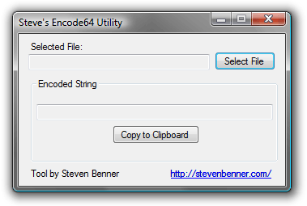

Are you an obsessive compulsive web site optimization nut? Are you willing to sacrifice maintainability for one less HTTP request? Have people ever asked you to seek a mental health professional because of your OCD? If so, then you are in good company. Us optimization nuts may not be very well received when we start building a project, but we become very appreciated when someone asks how to make it scale. Depending on who you ask, web optimization is either the most useless talent ever or the single most important skill on a web developers resume.

Allow me to broaden your optimization toolbox with the ultimate HTTP connection killer, the [data URI scheme](https://en.wikipedia.org/wiki/Data_URI_scheme). Most web developers have never heard of data URIs but they can dramatically reduce the number of HTTP connections required to download your web site.

This article will explain what data URIs are, how to use them, and how to properly implement them.

<!-- more -->

### What exactly are data URIs?

The data URI scheme (*aka data: URLs*) is a method to include data in-line in a URI.

I don’t suppose that makes much sense, let me elaborate; Simply put, data URIs allow you to include a file (or multiple files) inside of another file. The most obvious and practical use is to embed background images inside a CSS file. You do this by base64 encoding a file and embedding the contents, with some basic meta data, into a URI.

It is important to note that while the data URI scheme was created in 1998 it never reached the status of Standard Protocol. It is still on the list of “Proposed Standards”. However, all of the most popular *modern* browsers have implemented the data URI scheme.

Due to the IE problem (explained further down) data URIs can only be fully supported in CSS files.

### Data URI scheme

The format is pretty straight forward, the official data URL scheme as defined in the RFC is:

 > data:[\<MIME-type\>][;charset="\<encoding\>"][;base64],\<data\>

Okay, let me break that down for you and provide some real world examples.

Like any URI it starts with a protocol identifier, data. Just like http, ftp, mailto or gopher this tells the browser how to use the following information.

The first piece the browser needs to know is the MIME type of the data you are including (e/g image/png or text/html). Over normal HTTP transfers the server identifies the MIME type from the file extension and sends it back with the file in the response headers. Since we are not transferring the data through an HTTP connection there is no automatic MIME-type data, and we have to manually identify the type of data we are giving to the browser.

Next is the charset identifier, which is exactly what it sounds like. If you are passing any kind of text document (e.g. plain text, html, xml) then you should tell the browser what kind of character encoding your are using for that text (e.g. UTF-8 or US-ASCII).

And the last piece of possible meta data is the base64 keyword. This tells the browser that the following data is base64 encoded.

All of this meta data is optional depending on the data you are embedding. If you are passing an image you won’t include the charset information, likewise if you’re passing a text document then your probably wont be encoding it and will omit the base64 keyword.

### Useful examples

Here are a few examples of data URIs at work.

#### CSS background

In the real world, CSS backgrounds are about the only place where data URIs can be used (see: IE problem below). In my opinion this is the single best use for this technique anyway. We can embed all of our icons and backgrounds inside of the very style sheet that defines the rules that use those images.

```css
#logo {
	background-image: url('data:image/png;base64,iVBORw0KGgoAAAANSUhEUgAAAEkAAABJCAYAAABxcw[*about 2000 more characters*]AAAABJRU5ErkJggg==');
}
```

#### JavaScript

If you don’t have to worry about old versions of IE then you can use data URIs anywhere, even in JavaScript for any kind of URL destination. If you need to open a new window with a basic layout but don’t want to host an otherwise useless file then embed the layout in a data URI.

```javascript
window.open('data:text/html;charset=utf-8,%3C%21DOCTYPE%20html%3E%0D%0A%3Cht' +
	'ml%20lang%3D%22en%22%3E%0D%0A%3Chead%3E%3Ctitle%3EEmbedded%20Window%3C%' +
	'2Ftitle%3E%3C%2Fhead%3E%0D%0A%3Cbody%3E%3Ch1%3EDATA%3C%2Fh1%3E%3C%2Fbod' +
	'y%3E%0A%3C%2Fhtml%3E%0A%0D%0A', '_blank', 'height=300,width=400');
```

#### Embedded images

If you don’t need to support IE 6/7 then you can embed an image inside of the image tag itself with a data URI. This probably isn’t very useful, but it is a good demonstration of the technique.

```html
<a href="http://www.linkedin.com/in/stevenbenner" target="_blank">
	
</a>
```

#### Embedded links

Even Internet Explorer 8 won’t let you embed data in links because of security considerations, but it is another good demonstration of the technique.

```html
<a href="data:image/png;base64,iVBORw0KGgoAAAANSUhEUgAAAEkAAABJCAYAAABxcw[*about 2000 more characters*]AAAABJRU5ErkJggg==">
	Link to Twitter logo
</a>
```

### The Internet Explorer problem

As usual, Microsoft *Internet Explorer* screws up everything, data URLs are not supported in any version prior to Internet Explorer version 8. As much as I may want to add this to the hate list, I honestly cannot fault Microsoft for not supporting this until version 8. As I said earlier the data URI scheme is still on the list of *Proposed* Standards. So the fault rests entirely on the shoulders of the *[W3C](http://www.w3.org/)* for not looking at this [RFC](http://tools.ietf.org/html/rfc2397) for the last 10 years.

In addition to the problem of old versions, Internet Explorer 8 has some additional restrictions.

 * data must be smaller than 32KB
 * data URIs cannot be used for JavaScript
 * only object, img, input and link HTML tags can use data URIs

However, you can use data URIs in any CSS url statements, so there is still plenty of use for data URIs in the latest version of Internet Explorer.

#### Graceful degradation options for older versions of IE

There are two options for graceful degradation:

 * Make regular images available and use regular url links as a fall-back.
 * Or, use the MHTML technique.

Personally, I’m not a fan of the MHTML technique because it will greatly increases the size of your CSS file (doubling the number of embedded images). In my opinion, this is just too high of a price to pay. It is far simpler to make the images available on your server and just link to them with regular CSS url statements. At least it is for me, if for some reason you would rather take the file size hit instead of publishing the image files then there is a good MHTML how-to article [here](http://www.phpied.com/mhtml-when-you-need-data-uris-in-ie7-and-under/).

For the this article I will use CSS url fall-backs for graceful degradation.

### IE 6-7 specific CSS degradation

There are two ways to implement your CSS fall-back statements to target IE 6 and 7:

 * Use Internet Explorer revision targeting with conditional comments
 * Or, use the asterisk CSS hack.

Both of these are good choices, with simple pros and cons. IE revision targeting with *conditional comments* will require an additional CSS file specifically for older versions of IE, but in return it allows you to craft a style sheet that validates. Whereas the asterisk hack saves you the trouble of having an extra file but creates an invalid CSS statement.

Personally, I am anal about writing valid CSS and often have a separate CSS file for IE anyway (for IE PNG fix behavior statement) so I use IE revision targeting statements.

I’ll leave the choice up to you, so here are examples of both techniques:

#### Internet Explorer revision targeting

I’m sure you seen this technique countless times before, but here it is again. Internet Explorer supports version targeting statements in HTML comment blocks. These *conditional comments* are quite smooth because they produce valid markup and guarantee, for all time, that your code will only be parsed by the versions of Internet Explorer that you target.

The following snippet demonstrates how you include a CSS file that will only be seen and downloaded by Internet Explorer versions 7 and older:

```html
<link rel="stylesheet" type="text/css" href="base.css" />
<!--[if lte IE 7]>
<link rel="stylesheet" type="text/css" href="old_ie.css" />
<![endif]-->
```

In this example base.css is seen by all browsers but old_ie.css is only seen by IE 7 and older. Place this code in your HTML head block and the statements you place in old_ie.css will override the rules from base.css in old versions of Internet Explorer. For example:

**base.css**

```css
#logo {
	background-image: url('data:image/png;base64,iVBORw0KGgoAAAANSUhEUgAAAEkAAABJCAYAAABxcw[*about 2000 more characters*]AAAABJRU5ErkJggg==');
}
```

**old_ie.css**

```css
#logo {
	background-image: url(/images/logo.gif);
}
```

Now when a modern browser visits the page they will properly download and use the embedded background image but when an old version of IE visits the site it will use the rule from old_ie.css.

#### The asterisk hack

A less well known technique for targeting old versions of IE is the so called *Asterisk Hack*. This is a nifty little trick that someone, somewhere figured out. If you prepend an asterisk to a CSS rule then that rule will only be processed by Internet Explorer versions 6 and 7.

Here is an example of this hack:

```css
#wrapper {

	/* Processed by all browsers */
	background-image: url('data:image/png;base64,iVBORw0KGgoAAAANSUhEUgAAAEkAAABJCAYAAABxcw[*about 2000 more characters*]AAAABJRU5ErkJggg==');

	/* Only seen by IE 6 & 7 */
	*background-image: url('/images/graphic.png');

}
```

Simple! Unfortunately this is invalid CSS, which irks me, but it is a clean and efficient hack. Only IE 6 and 7 will see the second background statement, and since it comes after the default data URI statement, it will override it with a link to the image.

### How to get encoded files for data URIs

I built a little tool that allows me to quickly encode files on my computer. Here is the download if you would like to use it. This isn’t my finest work, it is just a basic tool to do the job in 20 lines of code, don’t expect a lot of bells and whistles.

**Steve’s Encode64 Utility**

<div style="text-align: center;">

[](http://stevenbenner.github.com/steves-encode64-utility/)

**[Click here to download](http://stevenbenner.github.com/steves-encode64-utility/)**

</div>

 * This tool is for almost any version of Microsoft Windows (sorry Mac users).
 * You can get the source code here: [Steve’s Encode64 Utility Source Code](https://github.com/stevenbenner/steves-encode64-utility) (GitHub project)

### How to generate base64 strings in code

If you need to dynamically generate base64 strings then you’re in luck, this task is quite simple. Here are a couple code examples to get you on your way:

#### PHP

```php
$encoded_string = base64_encode(file_get_contents('logo.png'));
```

#### C#

```csharp
private string Base64Encode(string fileToEncode)
{
	byte[] EncodeBuffer;

	using (FileStream fs = new FileStream(fileToEncode, FileMode.Open))
	{
		int Length = Convert.ToInt32(fs.Length);
		EncodeBuffer = new byte[Length];

		fs.Read(EncodeBuffer, 0, Length);
	}

	return Convert.ToBase64String(EncodeBuffer);
}
```

### Conclution

I think data URIs are an awesome, and powerful optimization trick. You can save many extra HTTP connections, and the associated latency and overhead for all of your users who are running a modern browser. This will make your site much snappier, especially if you use a lot of icons.

Using these techniques you can have a fully compatible web site that will gracefully degrade to traditional external resources if you can accept the following restrictions:

 * Only images
 * Only in CSS files
 * Less than 32KB each

I can see this working well for background images and for icons. With data URIs you can embed all of your presentation resources into the same CSS file that uses them. This file will grow much larger than normal but it will cache well and save in overall bandwidth.
