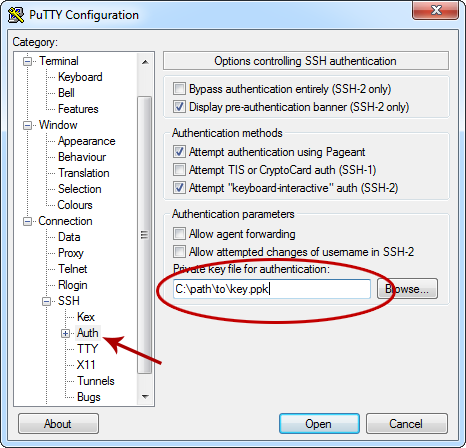

This will be the first part in a new series of articles about setting up your own *Ubuntu* LAMP *(Linux, Apache, MySQL, PHP)* server. If you are already proficient with Linux and/or Ubuntu then you can skip this first part because it is just about the basic post-install set up and configuration. For those of us who haven’t set up an Ubuntu system a hundred times over, here is the quick and dirty base Ubuntu set up guide.

Once you have your Ubuntu operating system installed there are still a few things you need to do to get it ready for prime time. A fresh install of Ubuntu will have a root account (you chose the password during installation) and the SSH server running. At the moment my recommendation for version is *10.04 LTS*.

Without further ado, lets get this show on the road. Start by connecting to your system via SSH and logging in to the root account. (For Windows users I recommend [PuTTY](http://www.chiark.greenend.org.uk/~sgtatham/putty/) as an SSH client)

<!-- more -->

### Create your account

The first thing to do is to create your account. Logging in as root is bad and you should never do it after you create a personal account. Create a new account with the *adduser* command.

```shell
adduser steve
```

Of course use whatever name you like for your account. It will ask you for various pieces of account information, all of which is optional except for the password. Be sure to use a strong password, this is the single most important piece of security for the entire system. If you choose a dictionary word for your password then it is almost inevitable that sooner or later, someone will find it and destroy your server.

### Give your new account sudo access

The reason you never have to log in as root is because your account will have super-user access via the *sudo* command. Sudo will let you execute other commands at nearly the same level as the root account. Open the sudo configuration file with the *visudo* command.

```shell
visudo
```

This will open a text file, at the bottom of that file add the following line (replacing “steve” with your account name).

```shell
steve ALL=(ALL) ALL
```

Now save the file and exit the text editor. Chances are this file was opened in *nano*, so you exit by hitting CTRL+X on your keyboard. It will ask you if you want to save the changes, say yes by typing “y” and hitting the enter key.

### Configure the SSH server

We need to add your new account to the SSH server so you can log in under that name. We will also do a couple minor tweaks to make the server much more secure. Nothing too advanced, just enough to get your SSH of the easy attack list. Open the SSH server configuration file in *nano*.

```shell
nano /etc/ssh/sshd_config
```

Here are the thing we need to do in this file:

 * **Change the port to something other than 22.** If you leave SSH running on port 22 it will constantly be under attack by botnets and hackers that try to find SSH logins for every IP on the internet. This little trick will save you from millions of automated hack attempts.
 * **Disable root login.** We do not want anyone (even you) to be able to SSH in as root. It is a huge security risk because root can do anything to the system.
 * **Disable X11Forwarding.** X11Forwarding is another security risk for numerous reasons. You simply don’t need it so disable it.
 * **Add your account to the list of users that can SSH in.** The SSH server will only allow the log in of accounts that are added to the configuration file.

First and foremost, lets make sure your new account can log in via SSH. Add the following line to the file (I usually just add this at the bottom).

```shell
AllowUsers steve
```

Again, replace “steve” with your account name.

Now for the security stuff. Find the following config statements and update them accordingly:

```shell
Port 12345
PermitRootLogin no
X11Forwarding no
```

**Remember your port number!** You will need it to SSH in to your server again.

Use any port number you like, I would recommend 4 or 5 digits because port sniffers start at 1 and scan up from there. So a large number will take much longer to find. This will thwart most lazy port sniffers. Do not use any of the standard service ports (e.g. 23, 24, 25, 80, etc). For a list of standard port numbers check out this [Wikipedia list](https://en.wikipedia.org/wiki/List_of_TCP_and_UDP_port_numbers). Basically any port number greater than 1024 should be okay to use. For better security use something 10000 or above.

Now reload the SSH server by entering the following command:

```shell
/etc/init.d/ssh reload
```

Now you can logout and log back in using your new account.

```shell
logout
```

SSH back in to your server and log in with your new account. You should now be logged in as yourself in your home directory. For now on when you need to execute something that requires *super-user* permissions you will do so via the *sudo* command.

### Update all of the installed software

The next step is to get all of the software on your system up to date. This is one of the best things about running Ubuntu, updates are incredibly easy using the *aptitude* tool. Frankly, this is even easier than Windows Update, and far more reliable.

Update the packages list with the following command:

```shell
sudo aptitude update
```

This grabs all of the latest package information from the Ubuntu servers for everything you have installed.

Note that when you use sudo it will ask for your password. This is just the password for your account login. It will save your sudo session for a few minutes, so if you need to execute several sudo commands it will only ask for your password the first time you run it.

Now you can upgrade everything that needs updates with the *safe-upgrade* command.

```shell
sudo aptitude safe-upgrade
```

It will list all of the packages (programs) that it wants to update and ask if you want to proceed. Enter “y” for yes and hit enter. The aptitude program will automatically download and upgrade everything that needs to be updated.

You should do this as often as possible, once or twice a week is more than enough if you’re anal about keeping everything updated with the latest fixes and security updates.

### Switch to key-based SSH login

It’s always a good idea to setup SSH to use key pairs to handle logins. This is a huge boost to security because it basically becomes impossible for an attacker to brute-force their way in via SSH.

The idea here is that instead of using a password to login to your account on the server your SSH client will prove to the server that you are in possession of the private key. The way this works (in SSH2) is that the SSH client will cryptographically sign a challenge from the server with the private key, then the server will verify that message with the public key. If you’re interested you can find a more detailed and technical explanation in [RFC 4252](http://tools.ietf.org/html/rfc4252).

Note that these instructions are targeted towards Windows users, because that’s what I use.

#### Generate the public/private key pair.

For Windows users you will use the [PuTTYgen](http://www.chiark.greenend.org.uk/~sgtatham/putty/download.html) utility to generate you keys. Open up PuTTYgen and create a new SSH-2 RSA key pair. The key can be however big you want, but 1024 bits is fine. If you feel compelled to increase it then change it to be a 2048 bit or [4096 bit](https://xkcd.com/538/) key. Make sure you set a password on it, and make sure that it’s a password that you will never forget. Then save the public and private keys to your system.

**DO NOT LOSE THE PRIVATE KEY!** If you lose your private key after switching to key-based logins then you will never be able to login to your server again, *ever*. There is no way to recover from this unless you have physical access to the machine or your host has a back-door in.

Make sure it is backed up in a safe place. Make sure it is backed up in multiple safe places.

#### Save the public key on the server

Now you need to give the server your public key. This public key will need to be stored in the ~/.ssh/authorized_keys file. This file will not exists in a freshly installed system so you will need to first create the file, then add your private key to that file (do not sudo these commands!).

```shell
mkdir ~/.ssh
nano ~/.ssh/authorized_keys
```

Now you are viewing the new authorized keys file. Here you will enter “ssh-rsa”, then paste the private key string, then add “user@hostname” to the end. It should look something like this:

```shell
ssh-rsa AAAAB3NzaC..........lots more...........6URYr15Xapm2+4sU8= steve@hostname
```

Now you need to make sure the directory and the file have the correct permissions. SSH is very picky about the user and permissions on the file and directory. The .ssh directory and the authorized_keys file must be owned by the user they reference, and the permissions have to be 700 for the folder and 600 for the file.

```shell
chmod 700 ~/.ssh
chmod 600 ~/.ssh/authorized_keys
```

#### Setup PuTTY to use the private key to login

Now you need to tell PuTTY about your private key. This is actually really simple, go to the Connections-&gt;SSH-&gt;Auth options and select the private key file.



**VERIFY THAT YOU CAN LOGIN WITH ONLY THE KEY!** Now make sure that you can successfully login with the private key. You should have to enter a password for the private key, but not to log in.

#### Disable password-based logins.

Now that you have verified that you can login with your private key and everything is working it’s time to shut down the ability to login with a password.

```shell
sudo nano /etc/ssh/sshd_config
```

Now change the PaswordAuthentication and UsePAM settings to “no”.

```shell
PasswordAuthentication no
UsePAM no
```

And then restart the SSH server.

```shell
sudo service ssh restart
```

And that’s it. Once you log out you will never be able to login again without the private key in your possession (unless you re-enable password logins).

### Install the base software

This is an optional step, but it is worth adding because a majority of people will need these packages anyway. There are a couple software packages that you will almost certainly need at some point, no matter what you do with your server. So let’s go ahead and install those now.

Lets start with *wget*, the tool you will use to download files from the web to your server. It’s just a simple file download tool that you will be using.

```shell
sudo aptitude install wget
```

The next item on the list is the [build-essential](http://packages.ubuntu.com/dapper/build-essential) package. It includes all of the software you need to build Debian/Ubuntu software packages on your machine. Most of the software you will be using will be downloaded pre-built and auto installed by the aptitude software, but if you need to build Apache modules or any other non-standard pieces of software you will require all of the suff in the *build-essential* package.

```shell
sudo aptitude install build-essential
```

This will download and automatically install everything in this package.

### Changing the system name

The name of your sever (aka “hostname”) is not only useful for keeping track of what server you’re looking at in a console window, but it is actually used to identify your account in a couple places (e.g. the authorized_keys file). If you’re setting up a VPS or dedicated server then you probably didn’t install the operating system yourself. Which means it probably isn’t named what you want it to be named.

First off pick a name for your server. Some people use the names of greek gods, some use simpsons characters and some use the names of minerals. There are countless naming conventions so pick whatever you want.

Of course the simplest way is to name your server based on it’s role. For example: www1, sql1, memcache1, etc. If you do use generic names like this you probably should add a number to the end in case you add more servers (e.g. www1, www2, www3&#8230;).

Now there are two places we need to enter your name to get the system to use that name, /etc/hostname and /ets/hosts.

```shell
sudo nano /etc/hostname
```

Enter the name you have chosen for the computer. There should be nothing else in this file.

```shell
sudo nano /etc/hosts
```

You will see the first line maps the 127.0.0.1 loopback IP to localhost. Just after that line you will add the name of your server, using the same format.

```shell
127.0.0.1 localhost
127.0.0.1 myservername
```

Once these files are save you will have to restart the server for the setting to take effect. Now when you login you should see your new server name in the console prompt.

### Useful commands you should know

Here are some of the most useful commands you should know for managing your system.

 * **sudo !!**

	This is one of the best little tricks to know. When you try to run a command but get a permissions error because you needed to sudo it, then you can run “sudo !!” which will execute the last command under sudo. This will save you lots of typing.

 * **free -m**

	The free command will display current memory usage information. This will be an invaluable tool for optimizing as well as diagnosing problems. The -m flag tells it to display the numbers in megabytes, instead of just bytes.

 * **df -h and du -h**

	The df and du commands report disk usage information. The df (disk free) command reports how much disk space is used and available on each partition. The du (disk usage) command reports how much space all of the files and folders in the current directory are taking. Both commands should be run with the -h flag which tells it we want human-readable (xxxKB, MB, GB) numbers.

 * **top**

	Use the top command to find out information about the processes that are currently running. This app shows a constantly refreshed list of the processes with memory utilization, CPU usage, time running and such. It’s a very useful tool for finding out which processes are taking the most CPU and memory. There are a lot of feature in this one so read the [man page](http://manpages.ubuntu.com/manpages/hardy/man1/top.1.html). Press “q” to exit the app.

 * **man**

	Of course real men don’t read instructions, so I don’t know why I’m listing this here. Perhaps it’s all of the times other real men have told me to RTFM. Anyway, man is the manual tool. For example entering “man top” will display the manual for the top application.

### Conclusion

That’s it. You now have an Ubuntu server running the latest software with the basic best practices for accounts and SSH security. You can go anywhere from here, set up a LAMP server, a mail server, a game server, whatever. Look forward to the next part of my Ubuntu server series where I’ll discuss installing and configuring the web server.
