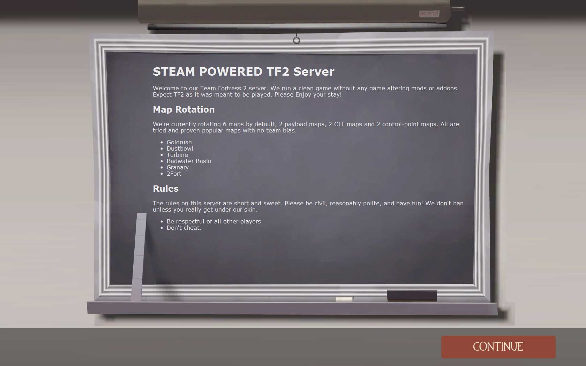
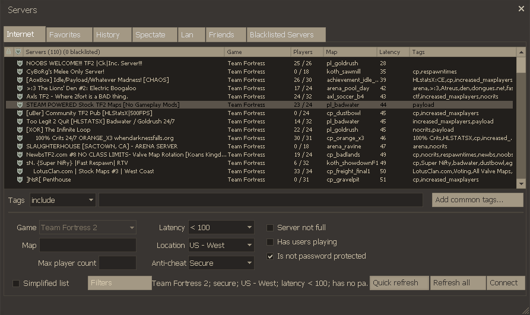

I recently decided that I wanted to set up a dedicated server running *Team Fortress 2*, the very entertaining multiplayer first-person shooter game by *Valve*. I was pleasantly surprised at how easy it was to install and configure a server that runs exactly the way I want.

All Valve multiplayer games run off of the same base server software, *Source Dedicated Server* (SRCDS). They build a version for Windows, Linux and Mac so you can run it on whatever system you happen to have available. In my case I had Ubuntu 10.04 LTS, which is a great operating system for any server.

This article will give you a walk though guide for installing and configuring srcds on Ubuntu. I am writing specifically about TF2 here, but much of this information will apply to other Source games such as Counter Strike: Source, Left 4 Dead, and Half-Life 2: Deathmatch.

### Basic server information

First off a few notes about the software:

 * The first thing that I should point out is the the srcds software is only available in 32-bit. So if you are setting up a server just for Source games then be sure to use the 32-bit version of Ubuntu. You will not gain anything by having the 64-bit version.
 * You may see references to “hlds” in places, hlds stands for Half-Life Dedicated server. This was the name of the old version of srcds (aka *Gold Source*) that ran the original Half-Life and Counter Strike. Don’t let it confuse you, the name is still used in places but (in this article) it is the same thing as srcds.
 * Depending on what game you’re running and what settings are applied srcds can use a good amount of processor and RAM. You really need at least 512 MB of RAM and a good modern processor to run a TF2 server properly. A gig to two of RAM will be optimal for running a couple instances. To my knowledge the srcds software is not multi-threaded so you wont see any benefits from a dual processor machine.
 * The server will require a huge amount of bandwidth. For a 24 player TF2 server with voice enabled running at max capacity 24/7 expect 800+ gigabytes of bandwidth per month. I regularly see the upload reach 3 Mb/s and download hovers at around 1.5 Mb/s.

### Setting up Ubuntu

For a basic system set up walk through please use Part 1 of my [guide to setting up an Ubuntu server](/2010/06/setting-up-an-ubuntu-lamp-server-part-1-initial-setup/). Everything in that article is relevant to this guide. The only thing that I should add is be sure not to run SSH on port 27015, since that is the port your Source server will be running on.

One extra step that you might want to do is to create an account for running the srcds process. This isn’t at all required, but it is good practice. The standard practice seems to be creating and account called “hlds” and using that account to run the process.

Also, if you’re running a good firewall (as you should be) remember to poke a hole for port 27015.

### Installing Source Dedicated Server

The installation of srcds is handled entirely by the hldsupdatetool created by Valve. This simple little tool will handle the download and installation of your base Source Dedicated Server. The first step in this process is to get the hldsupdatetool.

```shell
wget http://www.steampowered.com/download/hldsupdatetool.bin
```

This will download hldsupdatetool.bin to your current directory. Next we need to give this file execute permissions and the run it.

```shell
chmod +x hldsupdatetool.bin
./hldsupdatetool.bin
```

This will run the tool. It will present you with a license agreement, type “yes” and hit enter to proceed. It will install steam into the current directory.

Now we have to run the steam client, which will check to see if it is currently up to date and download a whole bunch of updates. This will take some time.

```shell
./steam
```

Now that steam is up to date and ready to run we are ready to install the Team Fortress 2 server. We do this via the steam client by giving it the following command.

```shell
./steam -command update -game tf -dir .
```

The dot after the -dir flag tells it to install the game server based in the current directory. You can tell it to install wherever you want, but most people just install it in home directory.

If you thought the steam update took a while, you might want to find something else to do for a while, the initial install of the Team Fortress 2 server requires downloading about 3.5 gigabytes of files. This will take a lot of time.

Once it has finished downloading everything it will return you to the console. The game server has been completely installed.

### Configuring your server

There are several files that you will want to edit for configuring and setting up your TF2 server. The big one is the server.cfg file located in the orangebox/tf/cfg folder. This file is where you set all of the server variables that control how your server runs.

There are literally hundreds of possible variables in srcds, many of which have no effect on a TF2 server. To simplify this guide I’ll provide you with a very simple sample server config file and talk about some of the more important variables. For a more complete list see [the complete list](http://www.dodbits.com/downloads/cvars/TF2/Team_Fortress_2_cvar_list_a-z.htm).

#### Basic server configuration file

```cpp
// General server settings
hostname "Payload/Control-Point Rotation [Fremont, CA]"
rcon_password "myunguessablepassword"
sv_password ""
sv_lan 0
sv_region 1

// game settings
mp_timelimit 30
mp_maxrounds 4
mp_winlimit 0

// voice settings
sv_voiceenable 1
sv_alltalk 0

// bandwidth rates/settings
sv_allowupload 1
sv_allowdownload 1
sv_minrate 10000
sv_maxrate 0
sv_maxupdaterate 100
sv_minupdaterate 66
sv_mincmdrate 66
sv_maxcmdrate 100

// run in pure mode
sv_pure 1
sv_pure_kick_clients 1
```

My server config is significantly more complicated than that, but trying to mention every possible variable that you can tinker with would be a huge article unto itself! This basic server config should be enough to get your server up and running with the best practices and and smoothest game play.

Any variable that you don’t explicitly set in the server config file will run it’s default value, which is exactly what you want for 99% of the variables.

#### General server settings

Most of these variables are pretty self-explanatory. The `hostname` is the server name that players will see in the server browser, `rcon_password` is the password for the remote console (make this a strong password), `sv_password` is the password to join the server (leave blank for a public server), and `sv_lan 0` sets the server to run as an internet server (instead of a LAN server).

##### sv_region

The `sv_region` variable is quite important. This tells the master list server what region your server is running in so players can filter out servers not in their region. Here are the possible values.

| Code | Region        | Code | Region    | Code | Region      |
| :--- | :------------ | :--- | :-------- | :--- | :---------- |
| 0    | US East coast | 3    | Europe    | 6    | Middle East |
| 1    | US West coast | 4    | Asia      | 7    | Africa      |
| 2    | South America | 5    | Australia | 255  | World       |

#### Game settings

There are three variables in the game setting section, `mp_timelimit`, `mp_maxrounds` and `mp_winlimit`. These are easily confused and mean different things in different types of maps. They are also the ones that new admins are most likely to screw up.

##### mp_timelimit

The maximum time a game is allowed to be played (in minutes). This one is easy to understand, what is the longest time that you want players to be stuck on a single map? This doesn’t count in the tie-breaker or sudden death round (which defaults to 2 minutes long).

##### mp_maxrounds

The maximum number of *“rounds”* that one team can win before the server changes maps. A round is an entire game where the teams win or loose the game. For example, in a payload map a round is everything from the gates opening to the cart being pushed to the last point. In a CTF map a round is from the gates opening to the the point where the winning team has captured the intelligence three times.

##### mp_winlimit

This is the one that can really screw things up. How many *“game points”* can one team earn before the server changes the map. In CTF maps a point is 3 intel captures, in payload maps a point is earned every time the cart is pushed to a control point, or a single point is given to the defending team if the round ends without the cart reaching the end, and in control-point maps a point is earned when one team captures the final control point.

Setting this to zero (no limit) works best, especially if you have different maps in your rotation. If you set it to a real number, like 4, then you will find the server changing maps in the middle of a payload game.

#### Voice settings

These are again self-explanatory, `sv_voiceenable` is whether or not to support voice chat, and `sv_alltalk` defines if *AllTalk* is enabled. If AllTalk is set to 1 then everyone can hear everyone else, if it’s set to 0 then only team mates can hear each other over voice chat. Generally, players use voice chat for tactical information, so set this to 0 unless you have a good reason.

### Running the server process (the right way)

Now that your Team Fortress 2 server is installed, configured and ready to go it’s time to start it up. You can do so by running the following command.

```shell
./srcds_run -game tf +map ctf_2fort
```

However, you probably want to be able to log out of your SSH session from time to time. So you will need to run srcds as a service. To do this we will use a shell script and the [Screen](https://help.ubuntu.com/community/Screen) utility. Screen is a command line multitasking tool that will allow you execute the process and detach it from your current session. Start by installing screen.

```shell
sudo aptitude install screen
```

Now we’re going to create a script called “srcds” in the /etc/init.d folder that will let you start, restart and stop the server with a very simple command.

```shell
sudo nano /etc/init.d/srcds
```

Now paste the following script in the text editor. I cannot take credit for this script, but it works well. I got this script from the [Linux SRCDS server](http://www.freenerd.net/index.php?title=Linux_SRCDS_server) article on FreeNerd.net. It’s worth a read since it covers a couple things I wont bother with in this article.

```bash
# replace <newuser> with the user you created above
SRCDS_USER="<newuser>"

# Do not change this path
PATH=/bin:/usr/bin:/sbin:/usr/sbin

# The path to the game you want to host. example = /home/newuser/dod
DIR=/home//orangebox
DAEMON=$DIR/srcds_run

# Change all PARAMS to your needs.
PARAMS="-game tf +map pl_badwater"
NAME=SRCDS
DESC="source dedicated server"

case "$1" in
	start)
		echo "Starting $DESC: $NAME"
		if [ -e $DIR ]; then
			cd $DIR
			su $SRCDS_USER -l -c "screen -d -m -S $NAME $DAEMON $PARAMS"
		else
			echo "No such directory: $DIR!"
		fi
		;;

	stop)
		if screen -ls |grep $NAME; then
			echo -n "Stopping $DESC: $NAME"
			kill `screen -ls |grep $NAME |awk -F . '{print $1}'|awk '{print $1}'`
			echo " ... done."
		else
			echo "Couldn't find a running $DESC"
		fi
		;;

	restart)
		if screen -ls |grep $NAME; then
			echo -n "Stopping $DESC: $NAME"
			kill `screen -ls |grep $NAME |awk -F . '{print $1}'|awk '{print $1}'`
			echo " ... done."
		else
			echo "Couldn't find a running $DESC"
		fi
		echo -n "Starting $DESC: $NAME"
		cd $DIR
		screen -d -m -S $NAME $DAEMON $PARAMS
		echo " ... done."
		;;

	status)
		# Check whether there's a "srcds" process
		ps aux | grep -v grep | grep srcds_r > /dev/null
		CHECK=$?
		[ $CHECK -eq 0 ] && echo "SRCDS is UP" || echo "SRCDS is DOWN"
		;;

	*)
		echo "Usage: $0 {start|stop|status|restart}"
		exit 1
		;;
esac

exit 0
```

**UPDATE: I have created a [repository for this script on GitHub](https://github.com/stevenbenner/srcds-service). Please check there for the latest version. I would also appriciate it if you would submit issues and pull requests to help improve it!**

The highlighted lines are the important ones that you will need to modify. As the instructions say, replace &lt;newuser&gt; with the username that you will be running the service as. This will probably be your username unless you have taken the time to setup a hlds user (a good idea).

The `SRCDS_USER` variable is the appropriate username, the `DIR` variable needs to be the path to the orangebox folder and the `PARAMS` variable are the parameters that will be used when running the server.

Once you have added this script save it by pressing CTRL+X (quit nano) and then Y to save changes.

You can now control the server via the following commands:

```shell
/etc/init.d/srcds start
/etc/init.d/srcds restart
/etc/init.d/srcds stop
```

Depending on your setup you may need to sudo these.

### Installing mods

For the most part, I do not recommend installing any game-play mods. Aside from the massive headaches and maintenance issues with outdated mods breaking servers (especially after game updates), Valve put a lot of thought in to TF2 game pacing and balance, and judging by their wild success they seem to have gotten it right. So, if it ain’t broke don’t fix it.

However, the rcon admin system is just plain bad. As a TF2 server admin you will at the very least want to run [SourceMod](http://www.sourcemod.net/). This srcds addon is a great administration tool and framework for other mods, you will find it to be an invaluable tool for managing your TF2 server.

SourceMod itself is a mod for the srcds mod framework [Metamod:Source](http://www.metamodsource.net/). So we will have to install that before anything else. This is pretty simple, just download the package and extract the contents to your game directory (orangebox/tf). This will add metamod to the addons folder. Metamod does not really require any configuration, once you have the files in the correct location it’s ready to go.

For a slightly more detailed walk-through check out the official guide: [Installing Metamod:Source](http://wiki.alliedmods.net/Installing_Metamod:Source).

Now you just need to install SourceMod on top of Metamod:Source. This is the same basic process, download the archive and extract the files you your orangebox/tf game directory. You should read the official guide for this as well: [Installing SourceMod](http://wiki.alliedmods.net/Installing_SourceMod).

Once you have all of the files in their correct locations then you have successfully installed SourceMod, the base admin tool and the framework for any other mod you could ever want. Restart the server and it should all be up and running.

#### Adding SourceMod admins

Before you start adding mods you should add yourself (and anyone else you want) as a SourceMod admin. This is quite easy. I personally use Steam IDs to authenticate people as administrators, this is reasonably secure so long as you are running the server with Steam enabled (which you should be).

Start by grabbing your Steam ID. You can easily get the Steam ID of anyone you want from the [Steam ID Finder](http://steamidfinder.com/) if you know their name.

Now add them to the admin file. Open up orangebox/tf/addons/sourcemod/configs/admins_simple.ini and add the following to the end of the file:

```shell
"STEAM_0:1:1234567"    "99:z"
```

Of course replace the Steam ID with your real Steam ID. This will grant the person with this Steam ID all admin permissions with an immunity value of 99. The next time you join the server you will be able to use the *sm_admin* command in the console which will bring up a simple little admin menu in-game. You will also be able to use any other the other [Admin Commands](http://wiki.alliedmods.net/Admin_Commands_%28SourceMod%29).

It’s that simple, but it can get as complicated as you want. For more information on the admin format read the [Adding Admins](http://wiki.alliedmods.net/Adding_Admins_%28SourceMod%29) guide.

#### Adding mods/addons/plugins

The [AlliedModders forums](http://forums.alliedmods.net/) have basically every mod in existence. It would take another full article to explain the important ones and walk you though configuration, so I’ll just provide you with the basics.

Browse the [SourceMod Approved Plugins](http://forums.alliedmods.net/forumdisplay.php?f=108) forum for mod you want to install. The thread will have all of the information you need to configure the mod.

Once you’ve found a mod you want download the mod and install the files in the appropriate locations. Generally the smx files belong in the orangebox/tf/addons/sourcemod/plugins folder and the configuration files belong in the orangebox/tf/addons/sourcemod/configs folder.

### Creating a MOTD

The Message of the Day (MOTD) is the intro chalkboard screen you see when you join a server. It is an HTML document that runs in WebKit, so you can do just about anything you like here. Personally, I find the chalkboard look to be the most professional looking MOTD.



The Message of the Day page is located in the orangebox/tf folder as motd.txt. Here you can create your HTML page that will be shown to players who join your server.

I’m not going to try to teach you HTML or CSS, so I’ll simply provide you with the markup for a simple Message of the Day sample page.

#### Example page markup

```html
<!DOCTYPE html PUBLIC "-//W3C//DTD XHTML 1.0 Transitional//EN"
	"http://www.w3.org/TR/xhtml1/DTD/xhtml1-transitional.dtd">
<html xmlns="http://www.w3.org/1999/xhtml">
<head>
	<meta http-equiv="Content-Type" content="text/html; charset=utf-8" />
	<title>Welcome to the Server</title>
	<style type="text/css">
		html, body {
			height: 100%;
			margin: 0;
			padding: 0;
			overflow: hidden;
			color: #ECECEC;
			font-family: Verdana;
		}
		img#bg {
			position: fixed;
			top: 0;
			left: 0;
			width: 100%;
			height: 100%;
		}
		#content {
			position: relative;
			z-index: 1;
			margin: 0 auto;
		}
	</style>
</head>
<body>
	
	<div id="content">
		<h1>My TF2 Server</h1>
		<p>
			Welcome to my Team Fortress 2 server.
		</p>
	</div>
</body>
</html>
```

This is a very basic motd screen. I don’t remember where I got the blackboard graphic, but kudos to whoever did it because it works on just about every resolution. Replace the “Welcome to My Team Fortress 2 server” text with whatever you want.

For more advanced layout you’re going to have to learn some HTML and CSS, Google is your best friend here. Don’t get too crazy though, if your motd is too long then no one will read it.

### Updating your server

You will have to occasionally update the server software, whenever Valve releases updates to Steam or the game itself. This is a very simple task, in fact you’ve already done it before. We will be running the same two commands that we used to install the server.

The first thing you need to do is shut down the srcds process.

```shell
/etc/init.d/srcds stop
```

Next you’ll want to execute the Steam software, which will automatically check for updates, and update itself if it needs to.

```shell
./steam
```

Now you’ll need to have srcds check for TF2 updates.

```shell
./steam -command update -game tf -dir .
```

That’s it! Your Steam software and TF2 server software have been fully updated. Now you can start the srcds process again and get back to gaming.

```shell
/etc/init.d/srcds start
```

You’re server is now up and running with the latest updates.

### Attracting players

This is a tough topic to address, getting players to join your new server can be very difficult, and frankly random. I don’t have a recipe for success to offer you because there just isn’t one. But here are some of the top things that will make your server more desirable to other TF2 players.



 * **Have a good ping (&lt;50ms).** This is one of the most important things that players will be looking for, a server with low latency will attract many more players than a server with a marginal ping. Of course a server with a terrible ping will never attract anyone because the experience of TF2 is lost on a laggy server.
 * **Choose a good name.** It should stand out some, but be readable and advertise what makes your server worth playing on. Are you running special mods? Advertise them, not only to tell players what to expect, but to get people who are looking for those mods to notice. If you’re running custom maps you might want to say that as well. But you’re going to have to keep it fairly short, long names get truncated in the server browser.
 * **Find a good map rotation.** It’s hard to define this, different players are looking for different things. Even today 2Fort seems to attract players (even though I find it fairly boring), but this is more of a personal choice. Pick maps that are actually fun to play on.
 * **Set the region code properly.** This has become far more important with a recent TF2 update. Setting your region code correctly will allow players to filter by the right region to find your server.
 * **Get friends to help jump-start your server.** The catch-22 of populating a server is that players tend to only join already populated servers. After all, who want’s to join a server with no one playing? If you have a few people (4-10) that you can coerce into playing on your server at the same time (during peak hours for your region) then you will see random people join. If your server keeps its low ping and stays lag free then it will fill up in no time.
 * **Participate, and foster a sense of community.** Last, and possibly the most importing item, play on your server. Talk to people, make friends, encourage players and make them feel welcome. Kick and/or ban people who mic-spam (too much) or who stack teams. Make the server fun! And show players that there are admins who will keep the game experience smooth and entertaining.

### Finding admins

It is a simple fact, you cannot be on your server 24/7/365. You can make the server more self-sufficient with mods, but you will need other admins to help keep the peace and kick/ban offensive players. I can’t really help you find admins, but I can give some some bullet points to think about.

 * **Do not give anyone rcon access.** Only the system administrator (you) should know the rcon password. Anyone with the rcon password can do terrible things to your server.
 * Only give full admin permissions to someone you really trust, and only via the SourceMod admin feature. The SourceMod admin has everything necessary to be an admin.
 * The type of people you accept as admins will define the attitude of your server. Make sure their personality is the kind that you want to reflect your server.
 * Bad admins can literally ruin your server. They can ban everyone from the server, change the maps randomly and kill players on a whim.
 * Real life friends are almost always better choices for admin roles than online friends. But there are plenty of good internet people out there.
 * Look for players who frequent your server. The best admins will be the admins who spend a lot of time playing on your server.
 * Do not give admin roles to anyone under 21 years old. Yeah, there are good kids out there, but generally this is an excellent rule.

Basically, be careful about giving out the admin role. Get to know someone (over voice chat) before you offer them an admin role. Good admins will be the single greatest addition to your server, bad admins will spell irrevocable doom.

### Conclusion

It’s quite easy to setup a Team Fortress 2 server and keep it running. The hardest and most expensive part will be finding the right host or paying for the colocation at the right data center. If your server takes off and becomes successful you will be able to enjoy a gaming experience custom suited to your tastes. If you’re really lucky you can even offset the costs with donations.

If you’re planning on setting up your own TF2 server then hopefully this article has offered some helpful information and give you some food for thought. If you have any questions please leave a comment below and I’ll respond back asap.
