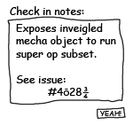
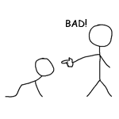
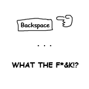
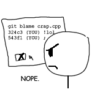
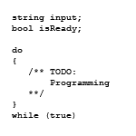

I was meditating yesterday, as I often do, when I was visited by a supernatural being who called himself *Gitsvn Hgtfs*. He said that he had brought the good news of version control and that I was to be his prophet. Needless to say, I was so surprised that I almost knocked my beer over.

When I asked what task he would have me to do, *Gitsvn* bestowed upon me two invisible golden tablets, with ten sacred commandments written in a strange script that only I can read. He instructed me to spread these glorious words among his chosen people.

And so I present the holy commandments of source control, with my understanding of their meanings.

<!-- more -->

### Commit bad code by proxy

<figure class="sectioncontent">

</figure>

Did you write some questionable code yourself? Then the best course of action is to “work” with one of your team mates. Email the code in question to them and ask them to take a look at it, them make them check it in *“since you already have the project open”*.

This will divert the attention (and ire) when it inevitably breaks.

### Craft evasive and mystifying check in notes

<figure class="sectioncontent">

</figure>

Don’t directly say what you did in the check in notes, it makes it to easy for people to follow your trail. Instead of simply spelling out what changed and why, attempt to enter as many words as possible without actually saying anything. A good technique is to try injecting bizdev terms like “synergize” and “vision”.

If all else fails, just reference a task ID that does not exist.

### Do not commit small change sets

<figure class="sectioncontent">

</figure>

When someone checks in small changes they are easy to identify and read, this lets anyone reviewing the history know exactly what changed, as well as give them the power to easily revert your changes. You should not give away such an advantage to parties unknown. It is better to make innumerable changes and/or combine the work of many tasks into one check in.

### When in doubt, change things for no reason at all

<figure class="sectioncontent">

</figure>

It is usually advantageous to pad your check-ins with extra “work”. Especially when it is difficult to see exactly what changed, and completely impossibly to identify why. Get creative, it’s amazing how much you can change without changing anything. Swap around the conditionals, reorder switch statements, mix up some associative arrays.

This will serve to confuse and disorient your enemies.

### Do not fix a an error until all know who wrote it (unless it was you)

<figure class="sectioncontent">

</figure>

So you’ve diagnosed the problem, and have located the exact block of code responsible, great! But you cannot proceed with the fix until you have sifted through the history and identified the individual who wrote that code. It is now your sacred duty to call said person out and make sure everyone on the team knows where the fault rests!

### Change tabs to spaces, or spaces to tabs

<figure class="sectioncontent">

</figure>

When you have a file open, swap the whitespace around. One of two things will happen, either diffs will ignore the whitespace and see no change, so the next person to get the file will be taken completely by surprise when they start coding. Or, the diffs will see the white space and mark every line as changed, essentially marking your territory as the *alpha* of its change history.

### Leave no rarely used project in a buildable state

<figure class="sectioncontent">

</figure>

Sure, you’ve got access to lots of legacy projects running around the system. Start working on them, checking in as you go, then abandon the project, leaving only your commits behind. If you did this right and obey all of the commandments then the project is essentially lost to the ages. A long forgotten unreconstructable quagmire of history, broken structures, and sin, like ancient Greece, or New Orleans.

### If you find a bug you are responsible for, ignore it

<figure class="sectioncontent">

</figure>

When you find a bug of your own making, for heaven’s sake, do not acknowledge it! Hell, don’t mention it, don’t have it open on your screen, do not even think about it. You may be tempted to check in a fix, but by doing so you will have admitted that you screwed up, and that is not something you should ever do.

Such things are best left forgotten and buried. With any luck nobody will know about it until long after you’ve moved on.

### Rebase, reset, and filter often

<figure class="sectioncontent">

</figure>

They say that history is written by the victor, and that’s almost right. In reality history is *rewritten* by the victor, and that is exactly what you are. So take every opportunity to rewrite history.

It doesn’t even have to be big stuff, some of the greatest rewrites of history were minor. Squash a few unrelated commits together, rename a file from the beginning of time, rewrite some commit messages. Little things can make all of the difference in the world.

### Commit often, preferably before any actual code has been completed

<figure class="sectioncontent">

</figure>

There are many people evangelizing the benefits of committing often, but you need to step it up a notch. Commit very often, say, every 10 minutes or so. Any wild tangent that your code is taking should be promptly checked in.

Not only does this impress the management with your amazing productivity and work ethic, but it also leaves half completed work in source control, guaranteeing your position for another day.

### Conclusion

I have given you this divine knowledge. Now it is your noble task to spread the gospel of *Gitsvn Hgtfs* to the world. Always hold these truths in your heart and let no coder go ignorant of the sacred rules.
